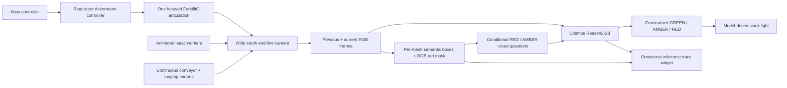

# Live Cosmos Reason2 forklift safety in Isaac Sim

This tutorial runs a user-controllable factory/logistics demonstration in
Isaac Sim 6.0.1. One focused official Isaac forklift shares a tightened room
with a continuous animated conveyor, looping cartons, two realistic belt
workers, one stocked rack, and three synchronized model-driven stack lights. The
other two articulated forklifts and two background workers are disabled in
this detector-focused revision.

Cosmos Reason2-2B applies this policy:

- **GREEN** — no forklift is inside the red zone and every forklift is still.
- **AMBER** — at least one forklift is moving anywhere in the room.
- **RED** — any part of any forklift is already in the red zone.

Workers are deliberately allowed beside and inside the marked area. They may
stand at the conveyor and touch parcels, but never affect the signal.

> This is an experimental physical-AI demo, not a certified safety controller.
> A real installation still needs calibrated detection, coverage for
> occlusion and camera failure, and an independent deterministic interlock.

## Architecture

The selected detector is a low, wide camera just beyond the open south end of
the room, facing the far end of the conveyor. It sees the complete focused
route, rack, marked zone, conveyor, and both workers in one frame.



The image-space front end:

1. segments the marked red region from the current RGB frame;
2. reads tight per-mesh semantic boxes from both forklifts' visible geometry,
   retaining one union box per vehicle only for motion tracking;
3. uses RGB vehicle recovery only if the semantic actor is missing;
4. matches the forklift to the preceding frame;
5. measures camera-pixel velocity; and
6. retains projected-entry timing as a diagnostic for comparison with the
   earlier direction-aware policy.

The previous and current images are sent directly to Reason2 so it can infer
motion. Its boxes, overlap flags, motion result, and proposed signal
are not model inputs. A current red-box overlap may trigger a second binary
visual request. Visible forklift motion may similarly trigger a two-frame
AMBER question when the primary answer misses it. These requests receive only
RGB images and their visual questions—never coordinates, overlap facts,
controller input, metric clearance, or validation labels.

The complete prompt is intentionally short:

```text
Review the images in chronological order, with the newest image last.
Return R if any part of any forklift is inside the marked red zone.
Otherwise, return A if any forklift is moving at all.
Otherwise, return G.
Ignore human workers, parcels, and the stack light.
Return one letter only: R, A, or G.
```

The primary prompt is retained because the focused benchmark classified
stationary GREEN and short-window AMBER reliably. If the camera-space box
overlaps red but the primary response is not RED, Reason2 receives this
latest-frame confirmation:

```text
Return R if any tire, body, mast, or fork of the forklift touches or covers the
red-painted floor beside the conveyor. Otherwise return G.
Ignore people, parcels, and the stack light.
Return one letter only: R or G.
```

The front end decides only whether a conditional visual question is worth asking;
Reason2 still decides the applied signal. Both raw answers are shown in the
debug widget.

For visible motion that the three-way prompt does not classify as AMBER,
Reason2 receives the same two chronological RGB frames with:

```text
The images are chronological. Decide whether any forklift moved between them.
Return A if any forklift moved at all, in any direction. Otherwise return G.
Ignore people, parcels, and the stack light.
Return one letter only: A or G.
```

An AMBER answer is accepted only while the visual tracker also confirms
forklift motion. A RED answer is accepted only while at least one
rendered forklift mesh box overlaps red. These consistency gates suppress
impossible static AMBER and early RED states without sending their facts to
the model.

The simulator also calculates oriented forklift clearance for evaluation. That
oracle is logged separately and never overrides the model-driven tower.

## Scene assets and alignment

The scene root is:

```text
/World/CodexPoC/ConveyorSafety
```

It contains:

- an extended oval built from two Digital Twin `ConveyorBelt_A05` modules,
  two Isaac `ConveyorBelt_A08` modules, and two `ConveyorBelt_A11`
  180-degree turns;
- eight randomized official Isaac cartons transported as rigid bodies;
- one official Isaac `ForkliftC` articulation with an independent rigid-body
  pallet and enlarged carton stack plus a seated construction-worker driver;
- two official construction-worker characters with Human Motion Library
  animation;
- Simple Warehouse racks, frames, stocked cartons, and an official packing
  table with one simple static box collider;
- a compact factory shell, lighting, and one unambiguous red floor region;
- six detector experiment cameras plus a presentation camera; and
- three physical green/amber/red stack lights at the user-authored placements.

The three towers use a realistic 0.216 scale and have no oversized bases. Each
pole extends through the red-lens height, and each tower owns a local
`SceneWash`. A single model-state update changes every lens, glow, and wash,
so duplicated indicators cannot disagree or leave a wash at an old location.
All twelve SphereLights (three lens glows plus one wash on each tower) are
point-treated with a near-zero radius. This keeps their colored illumination
while preventing RTX from drawing a large gray emitter disk on nearby walls.
Because those tiny local lights are partly occluded by the poles and mounts,
three world-space 220,000-intensity DiskLights provide the presentation wash.
They sit above the normal camera views and cast the active GREEN, AMBER, or RED
color strongly across the nearby rack, warehouse floor, conveyor, parcels, and
wall without exposing a light-source disk.

The floor has no yellow boundary, dashed traffic line, or amber occupancy
band. AMBER represents forklift motion, not a second painted region. The floor
uses five official Simple Warehouse `SM_floor02` tiles, including their
`MI_Floor_02b` albedo, normal, mask, and roughness maps, for a worn epoxy
appearance. Their collisions are disabled; simple floor boxes remain the only
floor colliders. The fifth tile and a hidden support box continue the floor
behind the north wall. The safety marking uses an opaque, high-roughness red
Preview Surface rather than the earlier glossy translucent slab. Its center
and extents follow the complete oval, so the red floor underlays both straight
runs and the in-room portions of both turns. Its camera-side edge is exactly
one design metre beyond the oval, matching the west-side margin instead of
leaving excess red foreground. The north wall is split into three aligned box
prims: a left panel, a 1.30 m-high center plinth, and an upper lintel. Two
cutaways follow the extended parallel conveyor lanes, which continue behind
the wall and out of sight. The east wall remains omitted for the open demo
view.

The controlled vehicles are the articulated `ForkliftC` robots used by Isaac
Sim's own mobile-robot controller example. The drive loop sends rear-steer
Ackermann targets to `left_rotator_joint` and `right_rotator_joint`, and
independent angular-velocity targets to all four wheel joints. The configured
geometry is a 1.65 m wheelbase, 1.05 m track, 0.325 m front-wheel radius, and
0.255 m rear-wheel radius. Throttle ramps at 1.00 m/s², service braking reaches
1.50 m/s², steering is rate-limited to 1.20 rad/s, and speed is capped at
1.00 m/s. This realistic indoor pace also keeps adjacent-frame displacement
small enough for Reason2 to associate the same vehicle. The controller
produces wheel rotation, asymmetric inside/outside steering, inertia, rear
swing, and contact response instead of directly translating a USD transform.
Operator steering is inverted at the input boundary: requesting a left turn
deflects the rear wheels right and rotates the forklift nose left, as expected
for a counterbalanced rear-steer vehicle.

Xbox D-pad Up/Down drives the real `lift_joint`. Its authored 0–2 m prismatic
range is clamped in software, and its 0.90 m/s maximum speed ramps at
1.35 m/s². Releasing the D-pad decelerates the hydraulic target smoothly
before holding the current height; this avoids transferring a one-frame stop
impulse into the free pallet and carton. The loaded pallet and carton rise
through fork and pallet contact rather than
being parented to the mast. The right stick orbits the presentation camera
around the selected forklift. That camera follows the selected vehicle's body center; detector
render products remain fixed and are not affected by operator camera movement.
The Xbox View button cycles close, medium, and wide follow distances of
5.5 m, 8.0 m, and 11.5 m. Input is edge-triggered, so holding View cannot skip
multiple distances.

A one-controller-step oriented-box sweep prevents tunneling without creating
an artificial braking zone. PhysX contact on the conveyor is a continuous,
closed, low-poly stadium mesh sampled at 32 points. It follows the visible oval
with a 5 cm surface inset and has no internal curve-junction faces that could
snag parcels. The rack and floor retain simple box colliders. Collision APIs
on the decorative conveyor and rack references are disabled,
so the high-detail production meshes cannot stop a forklift early. Worker and
software forklift avoidance use 26 cheap straight/curve bounds around the same
stadium instead of one oversized rectangle, leaving the oval's center island
open. The short controller sweep only prevents tunneling between physics
steps.

Each enabled ForkliftC uses only 11 collision prims: two convex-decomposed
chassis meshes, three lift-link meshes including the two tines, four simple
wheel cylinders, and two small rear-steer rotator meshes. The bright
wireframe seen when the vehicle is selected is a render-selection outline,
not one collider per visible part. Replacing the chassis colliders with
coarse boxes would save little while risking poorer
mast, wheel, worker, and conveyor contact, so the stock collision setup is
retained.

Each forklift carries NVIDIA's official 1.213 × 0.802 × 0.143 m pallet as an
independent 22 kg rigid body resting on the robot's colliding tines. Its stock
mesh collision is disabled and replaced by four lightweight box colliders: a
thin upper deck and three lower runners. The two open channels between runners
admit the real tines instead of approximating the pallet as a solid slab.
The pallet is rotated 90° relative to the vehicle: its 0.80 m side runs along
the forks and its 1.21 m side spans across them for easier fork access.
An enlarged 0.72 × 0.68 × 0.50 m, 10.5 kg `SM_CardBoxA_01` carton is a second
rigid body resting on top of the pallet through real contact. It also uses one
simple box collider. There is no invisible moving support or rigid parenting:
the pallet and carton can independently slide, tip, hit the environment, and
fall during abrupt steering or fork movement.

Both load bodies use CCD, eight position-solver iterations, increased angular
damping, and a 0.75 m/s maximum depenetration velocity. The last setting caps
the corrective impulse if a tine and pallet collider briefly overlap, so a
contact correction cannot catapult the complete stack into the air. Linear
velocity remains free up to 4 m/s, preserving ordinary sliding, tipping, and
falling behavior.

The 24 shelf cartons use the same independent rigid-body treatment as the
belt parcels: each official carton visual has a matching simple box collider,
volume-derived mass, CCD, and damping. Three continuous 3 cm-thick collision
slabs follow the rack tiers, avoiding seams between the two visual shelf
assets, a narrow rear guard represents the back, and six slender box colliders
follow the visible vertical uprights. Every tier is packed from the projected
width of its four rotated carton profiles, with a 4 cm body-to-body gap and the
complete row centered between posts. The stock rack mesh collisions stay
disabled. Cartons therefore rest on the shelves, cannot intersect the beams
or one another, can be nudged or knocked off by the forks, and land on the
warehouse floor instead of falling through it.

The eight belt parcels are also independent rigid bodies. A fixed random seed
varies their length from 0.50–0.82 m, width from 0.32–0.54 m, and height from
0.22–0.42 m, so the demo has repeatable but visibly different aspect ratios.
Every parcel has a simple box collider, volume-derived mass, CCD, linear and
angular damping, and an official `SM_CardBoxD_04` visual reference.

The referenced carton visual also contains a stock triangle-mesh CollisionAPI.
It is disabled because the surrounding parcel already owns the simple box.
PhysX validates mesh approximation metadata before it checks
`collisionEnabled`, so leaving that disabled mesh at approximation `none`
causes repeated “triangle mesh collision cannot be part of a dynamic body”
fallback messages. Scene construction therefore authors `convexHull` on every
disabled visual mesh. The mesh remains disabled; the box is still the only
active parcel collider.

The oval surface has a zero-friction physics material with PhysX combine mode
`min`, matching NVIDIA's custom conveyor sample. While a parcel touches the
belt, the extension applies a world-space tangential force toward 0.55 m/s
plus a weak centerline correction. It never edits parcel transforms. A
meaningful outward contact impulse is preserved, and the belt force switches
off after the box clears the track. Fork tines can therefore push a parcel off
the conveyor; gravity then drops it onto the warehouse floor's independent
cube collider.

Workers deliberately remain upright animated characters rather than ragdolls.
Each one follows a persistent collision-free corridor route at up to 0.55 m/s and
uses a visibly active gait loop extracted from time codes 154–228 of the
official Human Motion Library `WalkForward` clips. This skips their near-static
opening and repeats the matched gait cycle twice per stage loop.

The retargeted walk clips are converted to in-place animation by zeroing the
horizontal translation of `RL_BoneRoot/Hip` at every loop sample while
preserving vertical gait motion. The collision-controlled Worker Xform is
therefore the visible character position; skeleton root motion cannot carry a
worker through a wall or over the floor edge independently of navigation.

Worker 1 loops in the open rectangle between the oval's west side and the
rack. Worker 2 starts at the north end of the west rack, walks to the
northwest side of the oval, pauses for two seconds facing the belt, and
retraces the route. Both routes detour below the packing table before turning
toward the belt. The path obstacle includes the table's same simple box and
the segmented oval envelope, so both workers stop at visible geometry without
treating the open center island as solid.

The navigator runs A* over a sparse rectilinear graph of the open west-room
corridors. Conveyor segments, the rack, table, walls, floor edges, loose cargo,
the other worker, and both live forklift bounds remove intersecting graph
edges. A blocked edge triggers a new route through an alternate lane. If the
rendered character still cannot complete the proposed move, its committed
route position, waypoint index, and dwell timer all remain frozen; after 0.2 s
the path is discarded and replanned from the visible position.

If the active forklift reaches a worker, the controller adds a damped sideways
push: the worker can stagger up to 1.25 m, then springs back toward the active
route segment.

The animation relationship is authored on both the enclosing `SkelRoot` and
the concrete referenced `Skeleton`. Isaac's skeleton query accepts inherited
relationships, but Hydra otherwise leaves these construction-worker skins in
their neutral pose. Direct skeleton binding makes the walk and blocked-idle
transitions visible in the rendered viewport. Heading changes are limited to
180 degrees/s, locomotion accelerates and decelerates around corridor turns,
and separate walk/idle thresholds add transition hysteresis so a momentary
contact cannot rapidly flip animation sources.

A 0.32 m horizontal capsule footprint constrains both patrol and push motion.
The worker stops at the visible conveyor body, west shelf rack, north/west
walls, open floor edges, and the current world-space bounds of the loose
physics carton. Axis-separated resolution still permits sliding along an
obstacle when pushed. When no displacement can be accepted, the skeleton
switches to its retargeted idle clip instead of walking in place; it resumes
the walk clip automatically when the obstacle moves or the route clears. The
worker assets themselves remain non-rigid, avoiding an unstable full-body
ragdoll or a rigid wedge between the forklift and conveyor. Worker contact
still has no effect on the Reason2 safety label.

The Human Motion Library does not include a forklift-specific driving clip.
The driver therefore uses the compatible `SitAndStandChair` sequence's
`SitLoop` annotation. The construction-worker assets use a 101-joint
`RL_BoneRoot` rig, whereas the motion library uses an 81-joint `Root/Pelvis`
rig, so a direct USD animation binding would leave the worker in a T-pose.
Scene construction first runs Isaac's `CreateRetargetAnimationsCommand`, then
samples time code 422—the middle of the stable seated interval—into a static
`SeatedDriverPose`. It removes the retargeted actor's horizontal
walk-to-chair displacement and preserves the seated height. The mount is
placed 62 cm behind the body origin and 77 cm high, clearing the molded seat
back while keeping the hips on the ForkliftC cushion. It uses a -90-degree
local yaw so the driver faces the ForkliftC controls and mast. A -20-degree
root rotation at `RL_BoneRoot/Hip` pitches the entire character toward the
steering wheel, keeping torso, pelvis, arms, and legs rigidly aligned. The same
retargeting step prepares `WalkForward`, `WalkForward_01`, `Idle`, and
`IdleTired` for the two floor workers.

The driver mount is a child of the articulated body, so it follows steering
and driving without repeatedly standing or sliding toward an imaginary chair.
Driver geometry is explicitly excluded from the `safety_forklift_*` semantic
label and remains ignored by the detector, just like the two floor workers.

The important production assets are:

```text
NVIDIA/Assets/DigitalTwin/Assets/Warehouse/Equipment/Conveyors/
  ConveyorBelt_A/ConveyorBelt_A05_PR_NVD_01.usd
  ConveyorBelt_A/ConveyorBelt_A11_PR_NVD_01.usd
Isaac/Props/Conveyors/ConveyorBelt_A08.usd
Isaac/Props/PackingTable/packing_table.usd
Isaac/Robots/IsaacSim/ForkliftC/forklift_c.usd
Isaac/Environments/Simple_Warehouse/Props/SM_RackShelf_01.usd
Isaac/Environments/Simple_Warehouse/Props/SM_RackFrame_03.usd
Isaac/Environments/Simple_Warehouse/Props/SM_CardBoxD_04.usd
Isaac/Environments/Simple_Warehouse/Props/SM_CardBoxA_01.usd
Isaac/People/Characters/male_adult_construction_01_new
Isaac/People/Characters/male_adult_construction_03
Isaac/People/Characters/male_adult_construction_05_new
Isaac/People/MotionLibrary/HumanMotionLibrary.usd
```

The vehicle parameters and joint mapping follow NVIDIA's
[ForkliftC mobile-robot controller example](https://docs.isaacsim.omniverse.nvidia.com/6.0.1/robot_simulation/mobile_robot_controllers.html).
The implementation uses the
[experimental Ackermann controller API](https://docs.isaacsim.omniverse.nvidia.com/6.0.0/py/source/extensions/isaacsim.robot.experimental.wheeled_robots/docs/index.html)
and creates independent copies through the
[Isaac Sim Cloner API](https://docs.isaacsim.omniverse.nvidia.com/latest/py/source/extensions/isaacsim.core.cloner/docs/index.html).

An A05 supplies the south 2.0 m of each straight lane. A05's roller center is
authored at local `X=0.5014 m`; both references compensate for that offset. An
A08 continues each lane north by 2.719 m, and A11 supplies the two 180-degree
turns. The A08 assets require an explicit placement matrix because their
authored transform-op stack is incompatible with `XformCommonAPI`. The
resulting aligned oval uses:

```text
center:                  (4.42, 1.268030) m
center-line radius:      1.50 m
straight half-length:    2.351374 m
track half-width:        0.55 m
belt surface height:     0.76 m
west/east lane x:        2.92 / 5.92 m
north/south join y:      3.619404 / -1.083344 m
```

The continuous collider is inset to a 0.50 m half-width so the rendered
forklift reaches plausible visual contact. See NVIDIA's
[Conveyor Belt Utility documentation](https://docs.isaacsim.omniverse.nvidia.com/latest/digital_twin/warehouse_logistics/ext_isaacsim_asset_gen_conveyor.html)
and the Isaac 6.0 `standalone_examples/conveyor_belt` sample for the
contact-velocity-field pattern.

The verified scene checkpoint is:

```text
artifacts/isaac_sim_checkpoints/reason2_conveyor_safety_stable_cargo_r38.usda
```

### Clone portability and asset storage

The verified r38 checkpoint is committed through Git LFS. Install Git LFS
before cloning, or fetch the large objects after cloning:

```powershell
git lfs install
git clone https://github.com/eivholt/qai-physics-reasoning.git
cd qai-physics-reasoning
git lfs pull
```

The checkpoint contains the complete project-authored scene layer: layout,
transforms, materials, cameras, lights, semantics, physics configuration, and
custom colliders. It has no absolute workstation paths. Its 15 production
asset dependencies are HTTPS references to the official Isaac Sim 6.0 asset
CDN, including the forklifts, workers, conveyors, cartons, pallet, packing
table, rack, and floor. Those NVIDIA assets are deliberately not copied into
this repository; Isaac Sim downloads and caches them when the stage first
opens. A new machine therefore needs internet access for its first scene load.

Model weights, compiled EVK bundles, host llama.cpp builds, captured inference
runs, and historical USD checkpoints are also excluded. They are much larger,
are reproducible or separately licensed, and are obtained by the host and EVK
setup sections of this tutorial. The repository is cloneable and runnable,
but it is not intended to be an offline redistribution of NVIDIA model or
Isaac asset payloads.

## Camera choice

The live detector uses `detector_endline`:

```text
eye:    (1.37, -6.10, 2.45)
target: (1.37, 0.10, 0.80)
focal length: 9.5 mm
horizontal aperture offset: -3.0 mm
capture: 512 × 288 host / 384 × 216 EVK
```

The eye and target share the red zone's `x=2.70 m` aisle boundary, making that
edge project as a nearly vertical line into the horizon instead of a widening
perspective wedge. This reduces false early RED calls caused by distant fork
tips covering a diagonal patch of red floor. A shifted sensor window retains
the complete forklift, west rack, both workers, and conveyor. The low pose
still preserves a conventional side profile of the cab, wheels, mast, forks,
and load.

A true orthographic isometric camera was evaluated from
`(-7.0, -7.0, 7.8)` using a 140 × 78.75 aperture. The raw three-way prompt
scored 7/9 on isometric versus 4/9 on endline: isometric solved RED 3/3 but
both cameras solved AMBER only 1/3. With conditional visual questions,
endline AMBER and RED each scored 5/5, while isometric AMBER scored 0/5.
Therefore `detector_endline` remains the live default and
`detector_isometric` remains an explicit benchmark camera.

The stack light casts a strong colored glow onto nearby geometry. The prompt
explicitly says that its color is prior model output rather than hazard
evidence. Each response records
`stack_light_signal_at_capture` and `possible_stack_light_color_bias` so the
demo can expose a feedback-bias warning without hiding the physical indicator.
Active-forklift selection halos remain hidden from detector frames because
they are operator UI rather than physical scene lighting.

One camera is sufficient for this bounded demo because the one route and the
complete zone are visible. A production installation should use additional
coverage where racks, loads, or other vehicles can occlude a forklift.

## Prerequisites

- Windows with Isaac Sim 6.0.1 at
  `C:\NVIDIA\isaac-sim-standalone-6.0.1`;
- Python 3 from PowerShell;
- an Xbox-compatible controller;
- a CUDA host for BF16 iteration; and
- access to the IQ-9075 EVK for final inference.

Run NVIDIA setup once:

```powershell
& "C:\NVIDIA\isaac-sim-standalone-6.0.1\post_install.bat"
& "C:\NVIDIA\isaac-sim-standalone-6.0.1\isaac-sim.compatibility_check.bat"
```

## 1. Start the host Reason2 server

Use the RTX host for fast scene and prompt iteration:

```bash
cd /mnt/c/path/to/qai-physics-reasoning
bash scripts/start_host_cosmos_reason2_server.sh
```

The endpoint is:

```text
http://127.0.0.1:18080
Cosmos-Reason2-2B-BF16.gguf
```

Verify it:

```powershell
Invoke-RestMethod http://127.0.0.1:18080/health
```

The observed host loop was approximately 0.30–0.43 seconds per model request.
Only one host Reason2 server is required. Isaac Sim accounts for the rest of
the large GPU-memory allocation; do not start a second llama server.

## 2. Start Isaac Sim and create the scene

```powershell
.\integrations\isaac_sim_mcp\launch_isaac_sim_poc.ps1

python .\integrations\isaac_sim_mcp\server.py --check-isaac

python .\integrations\isaac_sim_mcp\server.py `
  --tool isaac_create_conveyor_safety_scene `
  --arguments '{"new_stage":true,"start_playing":false}'

python .\integrations\isaac_sim_mcp\server.py `
  --tool isaac_enable_conveyor_safety `
  --arguments '{}'
```

Keep port 8226 bound to localhost. The Isaac Python bridge must not be exposed
to another network.

The scene starts paused. Pressing **Play** starts rigid-parcel belt physics,
collision-aware worker patrols, and inference. **Pause** or **Stop** prevents
new captures after the current request finishes. Capture uses
`pause_timeline=False`, so it does not silently cancel Play or undo a user
Pause.

## 3. Select the inference backend

The current inference backend is persisted in:

```text
artifacts/isaac_sim_conveyor_safety/inference_backend.txt
```

For host iteration:

```powershell
Set-Content `
  .\artifacts\isaac_sim_conveyor_safety\inference_backend.txt `
  host
```

For the final EVK demo:

```powershell
Set-Content `
  .\artifacts\isaac_sim_conveyor_safety\inference_backend.txt `
  evk
```

The easier live-demo path is to press **Xbox X** or click the **Inference
target** button in the Reason2 debug panel. The active rolling runner is
replaced, while Isaac Sim remains in Play, and the next request uses the newly
selected HOST or EVK endpoint. The choice is written to the file above and is
restored on the next extension startup.

Hot-reload the extension only when changing the file manually:

```powershell
python .\integrations\isaac_sim_mcp\server.py `
  --tool isaac_enable_conveyor_safety `
  --arguments '{}'
```

Backend-specific environment variables configure both sides of the toggle:

```powershell
$env:QAI_CONVEYOR_HOST_SERVER_URL = "http://127.0.0.1:18080"
$env:QAI_CONVEYOR_HOST_MODEL = "Cosmos-Reason2-2B-BF16.gguf"
$env:QAI_CONVEYOR_EVK_SERVER_URL = "http://127.0.0.1:18181"
$env:QAI_CONVEYOR_EVK_MODEL = "local/cosmos-reason2-2b:Q4_0"
```

The original `QAI_CONVEYOR_SERVER_URL` and `QAI_CONVEYOR_MODEL` variables
still override the backend selected at extension startup.

## 4. Drive with Xbox

| Input | Action |
|---|---|
| Left stick up/down | Forward/reverse |
| Left stick left/right | Steer |
| LB/RB | Select the previous/next forklift |
| D-pad up/down | Raise/lower forks |
| Right stick | Orbit the presentation camera around the selected forklift |
| View button | Cycle presentation distance: 5.5 m, 10.0 m, 15.0 m |
| X | Toggle live Reason2 inference between host GPU and EVK |
| Y | Reset the selected forklift's loose carton onto its forks |
| W/S | Keyboard throttle fallback |
| A/D | Keyboard steering fallback |
| I/K | Keyboard fork up/down fallback |
| R | Keyboard cargo-reset fallback |

The selected forklift has a colored presentation halo. LB/RB and the Q/E
keyboard fallback switch between the two opposing vehicles. The panel reports
requested and acceleration-limited speed plus the active fork height.

The debug panel reports that the conveyor and rack hard colliders are active.
The earlier software look-ahead brake is disabled, so it cannot zero throttle
before contact. The forklift can still enter the one-metre warning zone and
produce RED, while the simple PhysX proxy boxes prevent penetration. Worker
asset colliders are disabled; the damped scripted push and capsule obstacle
resolver keep workers movable without letting them enter the conveyor, rack,
walls, floor edge, or loose rigid carton.

Drive a forklift toward the conveyor:

1. stationary and clear produces **GREEN**;
2. movement in any direction while outside the zone produces **AMBER**; and
3. crossing the marked boundary produces **RED**.

A stationary forklift just outside the red zone remains GREEN. Amber is based
only on forklift motion, not direction or a fixed outer distance band.

## 5. Read the Omniverse debug widget

Open **Window → Reason2 Conveyor Safety**. The dockable panel shows:

- controller connection, active forklift, throttle, and steering;
- model stack-light state and validation-only clearance;
- backend, model, phase, request ID, and live inference timer;
- previous and current rolling input images;
- the exact prompt sent for the current request;
- raw model output;
- last inference time; and
- the current applied stack-light status.

The panel reads the atomically updated file:

```text
artifacts/isaac_sim_conveyor_safety/live_status.json
```

The tower is still model-driven. Ground truth appears only as a validation row.

## 6. Rolling inference behavior

The runner keeps exactly one model request in flight:

1. capture the newest end-line frame;
2. add it to a two-frame rolling window;
3. send the chronological rolling images and the short visual policy;
4. independently derive overlap and visible motion for scoring, and issue a
   conditional RGB-only RED or AMBER question only when warranted;
5. apply the model response and read post-application state in one Isaac
   call; and
6. immediately capture the next frame.

The detector keeps one render product, RGB annotator, and tight-bounding-box
annotator attached across frames. Semantic labels are applied only to visible
forklift geometry. Per-mesh boxes prevent an empty corner of a large union box
from producing early red overlap, while the union center tracks velocity. The
render resources are replaced only when the stage, camera, or resolution
changes. Between captures, the persistent render product's Hydra texture has
updates disabled; it is re-enabled only around the single Replicator step.
This preserves warm render resources without paying for a second continuous
RTX view. Repeated model signals update inference metadata without rewriting
lens colors or light attributes. The widget similarly changes an image's
`source_url` only when that input path changes.

The two most recent source frames are retained in `input_image_paths` and shown
in the widget. The live status file keeps only the most recent 20 responses,
while run artifacts preserve the complete evidence when a bounded run exits.

Artifacts are written below:

```text
artifacts/isaac_sim_conveyor_safety/frames/
artifacts/isaac_sim_conveyor_safety/runs/<run-id>/
artifacts/isaac_sim_conveyor_safety/live_status.json
artifacts/isaac_sim_conveyor_safety/auto_inference/reason2_runner.log
artifacts/isaac_sim_conveyor_safety/auto_inference/evk_tunnel.log
```

## 7. Run on the IQ-9075 EVK

Start the persistent GenieX service:

```powershell
scp .\scripts\start_evk_geniex_isaac_service.sh `
  ubuntu@192.168.1.158:/tmp/start_evk_geniex_isaac_service.sh

ssh ubuntu@192.168.1.158 `
  "bash /tmp/start_evk_geniex_isaac_service.sh"
```

The extension opens the localhost tunnel on Play. For manual inspection:

```powershell
ssh -N -L 18181:127.0.0.1:18181 ubuntu@192.168.1.158
Invoke-RestMethod http://127.0.0.1:18181/v1/models
```

The EVK contract is:

```text
model: local/cosmos-reason2-2b:Q4_0
image: 384 × 216
enable_think: false
output: closed GREEN / AMBER / RED JSON grammar
detector cadence: at most 1 new frame per second
request timeout: 15 seconds
service recycle: after every 35 completed requests
```

The host runner captures and sends 512 × 288 directly. The EVK runner captures
and sends 384 × 216 directly, avoiding the earlier 768 × 432 render followed
by a CPU resize. Rolling-frame data URLs are cached by path, modification time,
and size, so the previous image is not reread and base64-encoded for the next
two-frame request. EVK mode also caps new detector renders at 1 FPS. It still
submits immediately after the previous response when that response already
takes a second or longer; the cap only delays faster cycles. The presentation
viewport and simulation physics continue at their independent rates.

The current EVK software image has a known long-soak failure: after roughly
54 or more continuous vision requests, a request can remain outstanding and
the next process reports `ggml-hex: dspqueue_read failed: 0x0000002e`. That
state requires an EVK reboot. The live extension therefore limits each EVK
runner to 35 responses, restarts GenieX after the runner exits, waits for the
service to report ready, and then resumes rolling inference. A stalled request
times out after 15 seconds and triggers the same recycle path rather than
holding the demo for the previous 120-second timeout.

The presentation and simulation loops are not capped to the detector cadence.
The main, present, and rendering loops target 60 FPS while PhysX advances at
30 Hz. Forklift targets are applied at 30 Hz, worker routes at 20 Hz, and belt
force fields at 15 Hz with staggered phases. Identical steering, wheel, and
lift targets are not resent. A detector render marks its zero-delta capture
update so those three dynamic callbacks are skipped during the already
expensive RTX frame.

On the current RTX 5090 workstation, the resulting scene measured 30.1--33.5
FPS during normal Play without detector capture, with a typical frame around
28--31 ms. Host inference measured about 27.7 effective FPS with a 31 ms
median because the once-per-second off-screen detector render still produces
an occasional 90--130 ms frame. Disabling all demo-authored dynamic updates
only reached about 37--39 FPS, confirming that the remaining steady-state cost
is mostly PhysX, skeletal animation, and presentation rendering rather than
Python controller code.

Experimental runtime asynchronous rendering improved the local sample by only
about 2 FPS and was left disabled because Isaac Sim documents possible
Replicator incompatibilities. `wait_for_render=False` likewise moved the wait
to the following app update instead of eliminating the RTX work. Fabric was
not enabled: it avoids USD writeback, but this demo currently reads live USD
transforms for camera follow, worker contact, collision validation, and
semantic capture. A Fabric conversion therefore requires moving all live pose
access to USDRT or tensor APIs as one coordinated refactor.

The steady-state capture benchmark used one render step and one RTX subframe.
All five measured frames at 768 × 432, 512 × 288, and 384 × 216 retained the
single semantic forklift box. Median PNG size fell from 362 KB to 178 KB and
106 KB respectively. The RTX render itself remained 0.140–0.156 s, showing
that lower resolution reduces transfer cost but is not the primary render
bottleneck. Host Reason2 returned GREEN in 3/3 requests at every resolution.
Cached request preparation measured 2.0 ms, 1.3 ms, and 0.9 ms respectively,
so asynchronous base64 transfer cannot materially improve viewport FPS.

Evidence:

```text
docs/evidence/isaac_conveyor_capture_performance_r2.json
```

The earlier direction-aware compact r5 host benchmark on 2026-07-30
produced:

| State | Primary three-way prompt | Conditional visual question |
|---|---:|---:|
| stationary GREEN, endline | 3/3 | not invoked |
| short-window AMBER, endline | 1/3 | A on 5/5 |
| current RED overlap, endline | 0/3 | R on 5/5 |
| stationary GREEN, isometric | 3/3 | not invoked |
| short-window AMBER, isometric | 1/3 | A on 0/5 |
| current RED overlap, isometric | 3/3 | R on 5/5 |

The live endline loop logged `G; amber_confirmation=A` and applied AMBER
with a 1.4 s projected entry, then logged
`primary=A; red_confirmation=R` and applied RED at the first visibly touching
pose. Conditional AMBER measured 1.353 s. The 2.234 s RED benchmark cycle
included a deliberate teleport that rebuilt the render resource; normal
controller driving keeps it persistent.

Evidence:

```text
docs/evidence/host_conveyor_reason2_compact_projection_r5.json
artifacts/isaac_sim_conveyor_safety/camera_evaluation_compact_projection_ablation_r2.json
```

The simplified any-motion policy was then checked with a lateral displacement
parallel to the conveyor. Projected red-zone entry remained false, so this
specifically tested the new meaning of AMBER rather than the earlier approach
rule. The main three-way request returned G, the conditional motion question
returned A, and the live loop applied AMBER in 1.329 seconds. On the same
two-frame pair, the final binary wording returned A in 3/3 requests.

Evidence:

```text
docs/evidence/host_conveyor_reason2_any_motion_r1.json
```

The compact r5 scene could not be reverified on the EVK in this session:
`192.168.1.158` answered ICMP, but SSH and model-service ports 22, 8080, and
18181 were unavailable. The checked-in backend override therefore remains
`host` so pressing Play starts a working demo. Switch it to `evk`, restart the
GenieX service, and hot-reload the extension when those ports recover.

Earlier direction-aware focused r4 EVK results on 2026-07-30:

| State | Primary | Applied | Latency |
|---|---|---|---:|
| identical GREEN pair | AMBER | GREEN after motion gate | 3.472 s cold |
| AMBER, projected entry in 0.9 s | AMBER | AMBER | 0.780 s |
| RED, present overlap | RED | RED | 0.797 s |

The Play-controlled EVK loop also verified both sides of the AMBER gate:
static A was applied as GREEN in a 1.335 s cycle, while a 23.1 px/s approach
with projected entry in 1.7 s was applied as AMBER in a 1.400 s cycle.

Evidence:

```text
docs/evidence/iq9075_conveyor_reason2_focused_detector_r4.json
```

## EVK concurrency result

Two valid 384 × 216 requests were started simultaneously:

```text
request 1: 1.393 s
request 2: 2.738 s
total wall time: 2.740 s
```

The service accepted both connections but serialized model execution. Running
parallel clients therefore doubles the queued request’s latency without
increasing throughput. The demo intentionally uses one in-flight request and
submits the newest rolling window as soon as the prior response returns.

Evidence:

```text
docs/evidence/iq9075_conveyor_reason2_concurrency_r1.json
```

## Deterministic inspection

Place a forklift without gamepad input:

```powershell
python .\integrations\isaac_sim_mcp\server.py `
  --tool isaac_set_conveyor_safety_forklift_pose `
  --arguments '{"index":1,"x":-4.8,"y":-3.5,"yaw_degrees":90.0}'
```

Inspect validation and model state:

```powershell
python .\integrations\isaac_sim_mcp\server.py `
  --tool isaac_get_conveyor_safety_state `
  --arguments '{}'
```

Pose tools are useful for GREEN and RED placement. Amber requires consecutive
frames with visible forklift motion in any direction; a static near-zone pose
is intentionally not Amber.

## Safety interpretation

- Workers are ignored by policy and excluded from vehicle-scale tracking.
- Visible-geometry semantic mesh boxes are primary; RGB vehicle recovery is
  used only for a missing forklift.
- The physical tower is outside the selected endline detector frame but
  remains visible in the presentation and isometric views; selection halos do
  not enter detector captures.
- Model responses are grammar-constrained. Camera-space overlap can trigger a
  conditional visual question but never directly sets the tower.
- Simulator clearance is evaluation-only.
- A single wide camera is acceptable for this room-scale demonstration, not a
  substitute for production multi-camera coverage.
- Keep a conventional independent hard interlock for real machinery.
