# Physics-aware Edge AI: Simulation powered by QualComm IQ9 EVK serving NVIDIA Cosmos Reason2

**Author:** [Eivind Holt](https://www.linkedin.com/in/eivholt/), August 2026  

**Repository:** [github.com/eivholt/qai-physics-reasoning](https://github.com/eivholt/qai-physics-reasoning)  

**Target:** [Qualcomm Dragonwing IQ-9075 EVK / QCS9075 / Hexagon v73](https://www.qualcomm.com/developer/hardware/qualcomm-iq-9075-evaluation-kit-evk). Hardware generously sponsored by Qualcomm

**VLM Model:** [nvidia/Cosmos-Reason2-2B](https://huggingface.co/nvidia/Cosmos-Reason2-2B) Q4_0 GGUF running on device NPU

Physics-aware Vision Language Models for robotics and safety enables *vision agents* to reason like humans, using prior knowledge, physics understanding, cause and effect to understand, plan and act in real-life situations. This tutorial covers 
- deploying and running a physics-aware VLM on edge devices
- benchmarking on video clips
- creating static and interactive simulations
- fine-tuning models on automatically generated synthetic data
- increasing inference time tenfolds with a few tricks.


## What separates physics-aware VLMs from traditional VLMs
A *physics-aware* VLM such as NVIDIA Cosmos Reason2 is not a fundamentally diferent species of model; it's a VLM deliberately spescialized for reasoning about the physical world. Rather than merely recognizing objects or describing scenes, it is optimized to infer spatial and temporal relationships, physical affordances, action consequences, and the next sensible action from video or image. Training is the main differentiator. Cosmos uses curated physical-AI datasets, supervised fine-tuning, and reinforcement learning with verifiable tasks built around space, time, intuitive physics, and embodied decision-making.

## Tutorial contents
This tutorial explains how physics-aware VLMs open new possibilities compared to traditional Object Detection models, Object Tracking and traditional VLMs. This is demonstrated on a practical *video clip*, then on a planning supervisor for robotic vehicles in a *static virtual simulation*. Finally an *optimized* demonstration is presented in the form of an *interactive demo* implemented in Unreal Engine. Throughout the article the model is run on both a QualComm IQ9 EVK and on a host GPU for comparison of both speed and accuracy.

## 1. Real-video experiment: forklift proximity at a conveyor opening
This small experiment uses a random YouTube clip, [Damon Retractable Conveyor Forklift Access Gate video](https://www.youtube.com/watch?v=M788xHT0QNM) as a real-world camera test. In the video we see a demonstration of a conveyor belt that's able to split in half and retract, allowing a forklift to pass through, like a warehouse Moses. This proved an interesting challenge, as the model needs to distinguish an unusually behaving conveyor from a forklift.

Our challenge to the model is to detect when the forklift is moving **and** in close vicinity to the conveyor, about 50cm/1ft.

The 42.18-second video source was divided into 21 non-overlapping two-second windows. Each window contains eight chronological frames at 4 FPS. The prompt is deliberately narrow:

> **Lossy input matters:** the downloaded YouTube source is an H.264/yuv420p MP4, so pixel information is lost from the source. This degrades accuracy, as discussed later in the tutorial. To reduce further degradation, videos and images fed to the model are compressed losslessy (PNG/RGB H.264 at CRF 0).

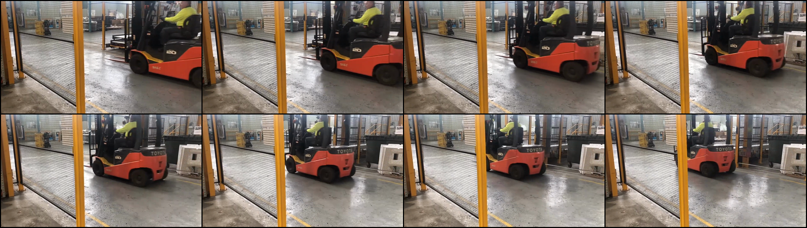

```text
SYSTEM PROMPT: You are a physical-AI observer. Use visible evidence only.
Put brief reasoning in <think> and the requested fields in <answer>.
```

```text
USER PROMPT: The supplied image is a 4-by-2 storyboard containing eight consecutive video frames over two seconds. Read the top row from left to right, then the bottom row from left to right.

Classify the event as ACTIVE only when the same foreground red-and-black Toyota forklift visibly changes position across the tiles AND it is immediately next to, or passes through, the narrow opening between the two low conveyor ends.
That opening is the fixed-camera proxy for <=50 cm. Classify it as INACTIVE if no foreground forklift is visible, the forklift is stationary, or it remains outside the opening. Motion of the retractable conveyor does not count.

Briefly verify both motion and proximity from visible tiles in <think>. Inside <answer>, write exactly one semantic label: ACTIVE or INACTIVE.
```
```python
Model settings: 
temperature: 0
top_k: 1
seed: 42
max_completion_tokens: 512
enable_think: true
```

### GPU BF16

The experiment was first run on a host computer with a RTX 5090 GPU. In this setting we can run the full non-quantized model version, [BF16](https://en.wikipedia.org/wiki/Bfloat16_floating-point_format) (Brain Floating Point 16, bfloat16). This is an exploratory stage before running the same experiment on edge device. The host run sends one lossless 1546 × 438 PNG storyboard per request. The storyboard contains all eight lossless 384 × 216 frames in a 4-by-2 layout. The overlay in the animated gif below displays the latest raw classification result and the end-to-end request time.


This raw run correctly detects three of the four `ACTIVE` windows. It also produces four isolated false-`ACTIVE` decisions, giving 16/21 overall accuracy. All 21 replies contain an unambiguous semantic label, although only one uses the requested `<answer>` wrapper. Further prompt-tuning didn't consistently succeed in increasing output structure, this is likely due to the 2B model size. As we'll see later, spending compute on output formatting on these kinds of bounded classifications on edge devices is a waste. 

### GPU BF16: rolling average of three results

The second presentation uses the same GPU requests and keeps the latest three inference attempts as a means to smooth out intermittent false classifications. Green is `INACTIVE`, red is `ACTIVE`, and grey is `inconclusive`. The fourth square is `ACTIVE` when the mean of the available votes is at least 0.5. Its `AVG` time is the sum of the three displayed request times.


The four raw false positives are isolated, while the missed `ACTIVE` window is adjacent to three correct `ACTIVE` results. AVG-3 therefore scores 21/21 on this small frozen sequence. In this experiment this adds temporal memory but it also delays or extends a state transition.

### IQ9 EVK: NPU result

The IQ9 EVK cannot use the host storyboard unchanged. Submitting the 1546 × 438 image to this full-NPU GenieX build reproduces a known `dspqueue_read failed: 0x0000002e` large-image failure. The successful EVK run therefore sends each same two-second window as a pixel-lossless RGB H.264 MP4 at 384 × 216. `libx264rgb`, CRF 0, and RGB24 avoid image quantization and chroma subsampling. All 168 decoded RGB frames were compared with their PNG inputs and matched byte for byte. The patched service gives the model eight ordered frames through its native-video path and runs `local/cosmos-reason2-2b:Q4_0` with GenieX `--compute npu --ngl -1`.


The lossless EVK run marks 22–24 seconds state `ACTIVE` and produces one false `ACTIVE` decision at 38–40 seconds. It misses the other three `ACTIVE` windows, reaching 17/21 overall accuracy with 50% `ACTIVE` precision and 25% `ACTIVE` recall on this small sequence.

### Accuracy and latency

This small experiment is useful for learning to use Reason2, not for estimating production accuracy. `TP` (True Positive) and `FN` (False Positive) refer to the four reference active windows; `TN` (True Negative) and `FP` (False Negative) refer to the 17 inactive windows.

| Presentation | Correct | Overall accuracy | TP / TN / FP / FN | Inconclusive | Active precision / recall | Mean / median / P95 request time |
| --- | ---: | ---: | ---: | ---: | ---: | ---: |
| GPU BF16, latest | 16/21 | 76.2% | 3 / 13 / 4 / 1 | 0 | 42.9% / 75% | 1.005 / 0.950 / 1.563 s |
| GPU BF16, average of three | 21/21 | 100% | 4 / 17 / 0 / 0 | 0 | 100% / 100% | same 21 underlying GPU requests |
| IQ9 EVK Q4_0 NPU, latest | 17/21 | 81.0% | 1 / 16 / 1 / 3 | 0 | 50% / 25% | 4.767 / 4.012 / 6.565 s |

After the first three results are available, the *average presentation's* displayed three-request total ranges from 2.26 to 3.61 seconds and averages 3.05 seconds.

### What lossless media changed

The first iteration of this experiment used lossy JPEG/default-H.264 inputs. Especially for the BF16 model, lossless replacements improved accuracy. The source YouTube video clip already suffers greatly from information loss, this probably could have improved significantly had a lossless original clip been available. This is a reminder when configuring video input - **make sure to avoid lossy image and video compression!**

| Current-service input | Latest | AVG-3 | Main change after going lossless |
| --- | ---: | ---: | --- |
| Host JPEG storyboard control | 18/21 | 17/21 | baseline control |
| Host lossless PNG storyboard | 16/21 | **21/21** | more isolated false positives, all removed by AVG-3 |
| EVK lossy H.264/yuv420p control | 18/21 | 18/21 | baseline control |
| EVK lossless RGB H.264 | 17/21 | 17/21 | false positives 2 → 1; true positives 3 → 1 |

### Real-video experiment takeaway
Pixel loss in the source video reduces model accuracy, we'll rectify this in the following demonstrations. Mean processing time of 1s on GPU is more than usable. 4-5s on IQ9 can be a problem for many scenarios, but in the final demo we'll hack the process to significantly speed up inference, while still returning the same results.

## 2. Warehouse supervisor simulation made in Omniverse Isaac Sim

With mature simulation tools at our disposal, almost any scenario can be simulated. NVIDIA Omniverse Isaac Sim for instance, can run a live simulation where we can stress test our application. We can connect our model, hosted on an edge device, to a simulation by sending a video feed over LAN or USB. Inference results can be returned and affect the simulation.

This demonstration runs a live warehouse in Isaac Sim 6.0.1, continuously sends security-camera images to Cosmos-Reason2-2B on a Dragonwing IQ-9075 EVK, and lets model output change a simulated robot's active navigation route.

The model running on EVK only ever sees camera feed and a prompt, it has no other knowledge about placement of actors in the simulation.

### Demo setup

In this demo we explore if an AI supervisor, extra eyes in the sky, could optimize autonomous logistics vehicles by communicating potensial congestions or hazards the Autonomous Mobile Robots (AMR) are unable to detect in time. The supervisor could have as many cameras as needed, placed at strategic point. To test this out a rudamentary warehouse was constructed in Isaac Sim, using standard assets. An autonomous vehicle, `RobotBlue`, was placed in an aisle and configured to use path finding to reach an endpoint. Several alternatice paths were defined and the supervisor is able to signal that an alternative route is better, if it sees a potential congestion in the standard route.

>This tutorial does not cover steps in creating a simulation in Omniverse. One may opt to leave this to a coding agent, see appendix for setting up a MCP bridge with Omniverse APIs.

The Omniverse simulation does not contact Reason2 directly; `scripts/run_live_isaac_evk_supervisor.py` acts as the bridge, capturing timestamped frames from the selected Isaac Sim supervisor camera through MCP, maintaining a rolling window, encoding its latest frames as a short chronological video clip, and sending that clip with the visual supervisor prompt to the resident GenieX Reason2 service on the EVK through its OpenAI-compatible HTTP endpoint. The EVK returns structured actor and passage-state observations, which the local gateway validates and deterministically translates into commands such as `CONTINUE_CURRENT_ROUTE` or `REROUTE_NORTH_BYPASS`; those commands are then applied back in Isaac Sim through MCP to update `RobotBlue’s` navigation graph while simulation and camera capture continue.

>Why does the Omniverse-to-EVK bridge use MCP? MCP is only the control bridge into the already-running Isaac Sim process—not the transport to the EVK. Isaac Sim’s USD stage, cameras, timeline, and navigation graph live inside its Kit Python runtime, so MCP gives coding agents such as Codex and the external runner a validated interface for capturing frames and applying commands without embedding all orchestration in an Omniverse extension. The images and prompts travel directly from the runner to GenieX on the EVK over HTTP. For a production system, we could remove MCP from the live loop by moving capture, EVK requests, and command application into a native Omniverse extension; MCP would then remain only for setup, inspection, and debugging.


The demo consists of two scenarios: `Clear-route` feeds the model with a camera view where nothing appears to block the robots planned route. In both scenarios the robot has 3 routes to choose from. In scenario `Blind-corner congestion` the same route is gradually blocked by an approaching forklift. The scenario is relevant because the forklift is occluded in the robot's field-of-view. Without the supervisors input it would be forced to retreat before continuing on another route.

### What Reason2 actually sees

Each request contains a rolling eight-frame tactical-camera window. Frames remain in chronological order and are encoded at 2 FPS, so each request contains four seconds of visible motion. No `EARLIER`/`NOW` labels, side-by-side layout, timestamps, route lines, or UI overlays are burned into the 384 × 216 input.

The model frames come from a fixed 1280 × 720 offscreen sensor as lossless PNG files. They are downsampled to 384 × 216, so both are 16:9 and no stretch or crop is applied. The runner then uses `libx264rgb` at CRF 0 with RGB24: decoded video pixels exactly match those resized RGB frames. Do not replace this with JPEG or default `libx264`/`yuv420p`; quantization and 4:2:0 chroma subsampling can remove small safety-relevant details before the model sees them.

The resize is still destructive preprocessing: 384 × 216 contains only 9% of the 1280 × 720 sensor pixels.


The following two images are synchronized at route application. They show what the two cameras saw when the EVK response was applied, demonstrating that only the supervisor field-of-view sees the forklift, the robot is still in the blind.


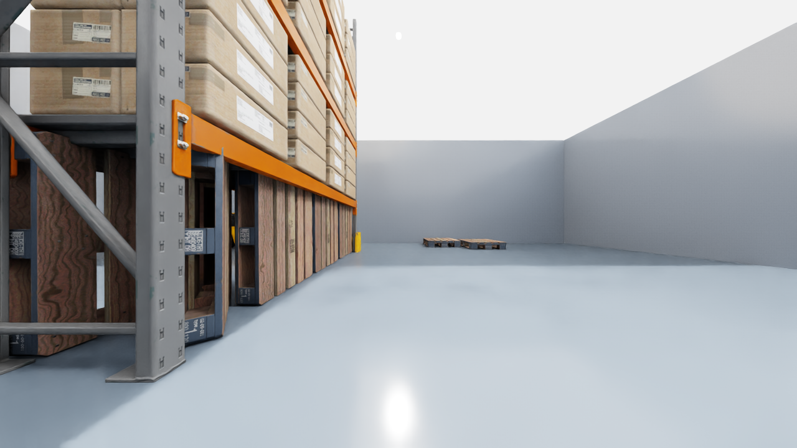

### Prompts

The demo uses a two-stage prompt: the primary prompt is a compact status of the two actors:

```text
Inspect every frame of the attached warehouse image or video using only visible pixels, then report each traffic-actor category once. RobotBlue is the compact white low-profile mobile robot. A forklift is a larger industrial counterbalance vehicle with long front forks, an upright mast, and an operator cage. Shelving, cartons, pallets, cones, barriers, floors, and walls
are not traffic actors. Reply with exactly these two lines, replacing STATUS with PRESENT, ABSENT, or UNCERTAIN:
mobile robot: STATUS
forklift: STATUS
Do not list individual frames or add other categories, descriptions, motion, or intent.
```

The gateway parses both category lines. Unless both `mobile robot:` and `forklift:` are explicitly `PRESENT`, the bounded result is
`CONTINUE_CURRENT_ROUTE` and route reasoning is skipped.

When a forklift is reported, the second request uses this prompt:

```text
Watch the complete fixed warehouse-camera video in chronological order, from its first frame through its final frame. RobotBlue is the compact white low-profile robot. A forklift is a larger industrial counterbalance vehicle with long front forks, an upright mast, and an operator cage. Shelves, cartons, pallets, cones, barriers, floors, and walls are static objects, not traffic actors.

Reply RobotBlue REROUTE_NORTH_BYPASS only when visible motion across the video shows the forklift and RobotBlue converging on the same narrow passage and their nearest-body gap clearly decreases from earlier frames to later frames.
If no forklift is visible, either actor is unclear, their gap does not clearly decrease, or the evidence is uncertain, reply RobotBlue CONTINUE_CURRENT_ROUTE.
Reply with exactly one of those two commands and no explanation.
```

### Results

| Demonstration | EVK responses | Applied behavior | Destination |
| --- | ---: | --- | --- |
| Clear-route | 37 | stayed on the direct route | northwest goal reached |
| Blind-corner congestion | 15 | two-vote EVK north reroute before RobotBlue can see the forklift | bypass goal reached |

The table shows how Reason2 on the EVK correctly refrained from suggesting route change in the `Clear-route` simulation. In the `Blind-corner congestion` it correctly suggested the north bypass as soon as it determined the forklift would block the passage between shelves on the planned route.


## 3. Interactive conveyor belt monitor

In the final demo Reason2 is put to the test in an interactive simulation. It'll cover
- Creating an high-fidelity interactive simulation using game engine principles, with game controller input and physics simulation.
- Streaming virtual sensor camera to Reason2 running on an EVK on the LAN or over USB.
- Reacting to model classification by simulationg a stack light.
- Generating automatically labeled synthetic training data.
- Fine-tuning Reason2 to increase model accuracy.
- Optimizing inference speed by omitting output token decoding, looking for expected tokens and their logits instead.

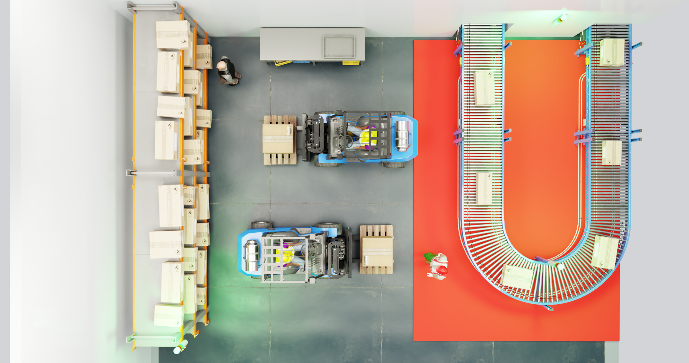
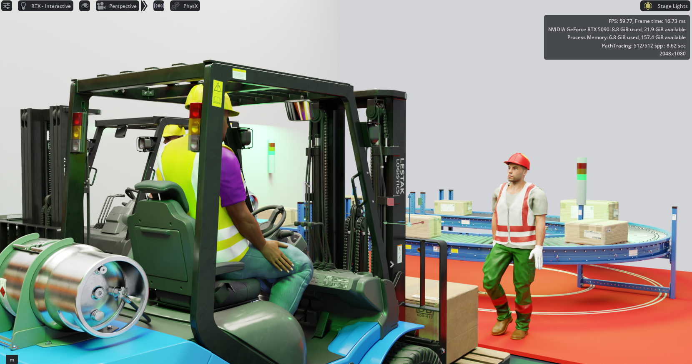
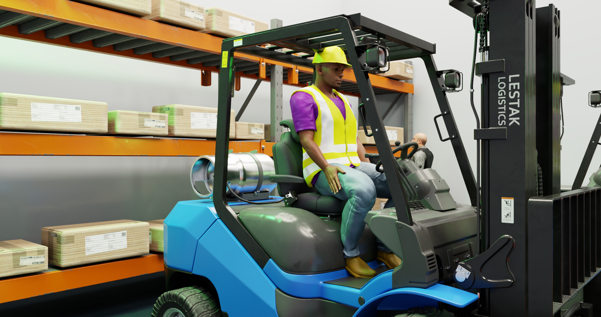
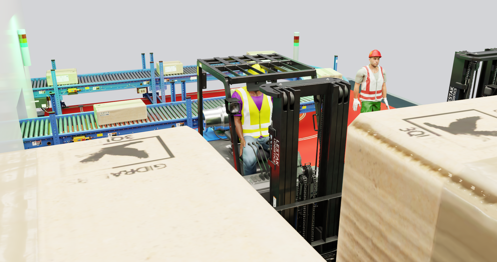

The scenario is a busy warehouse with workers, forklifts, parcels and a conveyor belt. A fixed sensor camera observes a conveyor lane and asks whether its cartons are safe, over an edge, or fallen. Imagine what implementing this detection system with traditional sensors would involve, even with object detection! The same image and prompt run on an RTX host GPU and a Dragonwing IQ-9075 EVK NPU, for comparison of accuracy and speed.

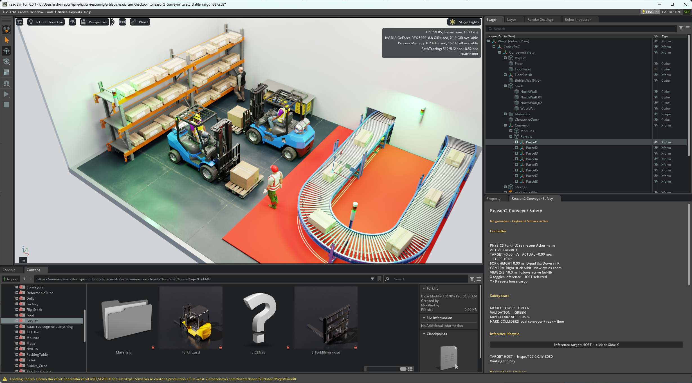
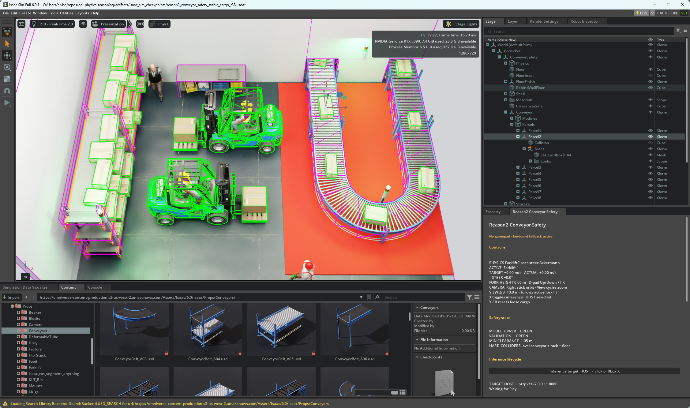

The simulator began as an interactive Omniverse Isaac Sim 6.0.1 warehouse experiment, as in part 2 of this tutorial. A 3D demo scene was quickly composed using readily available Isaac Sim 3D assets. Physics was implemented using simple bounding boxes with `PhysX`. Controller input was read on each Kit update through the `carb.input` SDK. Combining ray tracing, physics calculations, input polling and model interaction with inappropriate work distribution, brought the demo to a painful < 10 FPS performance, even on a RTX 5090 GPU. The prototype was therefore ported to Unreal Engine 5.8, using native Chaos physics and Lumen rendering engine. Isaac Sim is a great alternative for a first proof-of-concept, while Unreal Engine can squeeze resource intensive sub-systems into an acceptable performing end-product.

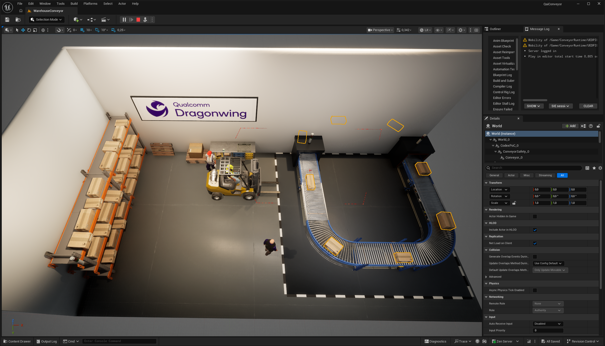
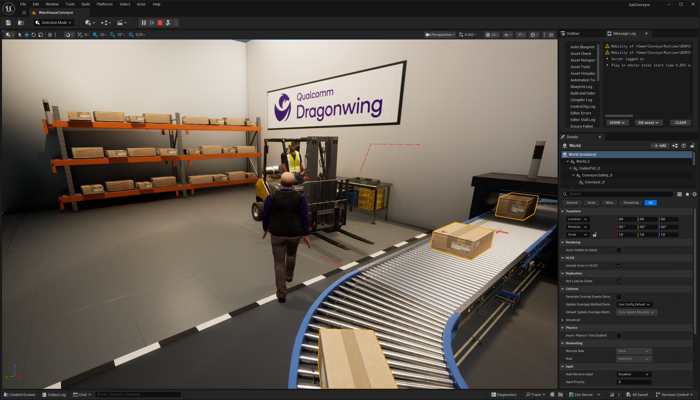

### Demo overview

| Part | Current implementation |
|---|---|
| Interactive client | Unreal Engine 5.8.1 |
| Model visual input | One lossless 448 × 256 PNG from a fixed 62-degree end-oblique camera |
| Task | `G` fully supported, `A` over-edge/tipping, `R` fallen |
| Host | `Cosmos-Reason2-2B-Parcel-Speed-v1`, llama.cpp, port 18084 |
| EVK | `local/cosmos-reason2-2b`, GenieX + QAIRT on the NPU, port 18183 |
| Inference strategy | Read one trained next-token decision instead of generating a reasoned answer |
| Rendering | D3D12, hardware Lumen and ray tracing |
| Release executable | `unreal_conveyor_demo/Saved/Packaged/Win64/Windows/QaiConveyor.exe` |

In this demo the model is able to predict it's task without temporal information, so we only pass a single image, in contrast to our previous use of storyboards.

### Architecture

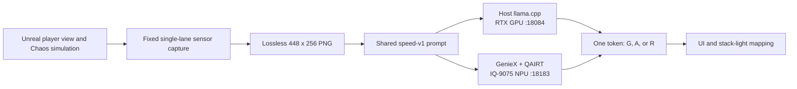

The capture, prompt, parser, class mapping, and operator presentation are identical when using either EVK or GPU hosted Reason2 models. Pressing B or Start changes only the endpoint and model identity. This makes the comparison about execution hardware rather than prompt drift.

Live capture is demand-driven and pauses while the model is busy. The client allows up to 1.5 new host GPU observations per second or 0.75 EVK observations per second.

### Parcel-safety policy

The client classifies the most unsafe monitored carton:

| Token | UI state | Meaning |
|---|---|---|
| `G` | GREEN / SAFE | Every monitored carton is fully supported by the rollers. Rotation and diagonal yaw are safe while the bottom remains supported. |
| `A` | AMBER / UNSTABLE_PARCEL | A carton still touches the rollers, but roughly one third or more extends beyond a blue rail, or the carton is visibly tipping. |
| `R` | RED / FALLEN_PARCEL | A carton is on the adjacent floor below roller-top height. RED has priority over AMBER. |

Workers, the forklift, wooden pallets, shelving, lights, and the separated return lane are not classification targets. The workers deliberately walks through the sensor view to demonstrate that ordinary scene context is ignored.

The HUD shows two states:

- **Simulator state** is the deterministic simulation engine ground truth used to evaluate the demo.
- **Reason2** is the model decision that drives the presentation stack lights.


### Adapting NVIDIA's prompting guidance

NVIDIA's [Warehouse Blueprint prompting guidance](https://docs.nvidia.com/vss/3.2.0/warehouse-docs/alerting-service.html#prompt-tuning) recommends explicit violation criteria, exclusions for common false positives, fixed labels, and evaluation against labeled examples. The conveyor demo follows these principles. Its [earlier prompt](https://github.com/eivholt/qai-physics-reasoning/blob/main/scripts/reason2_finetune/generative_common.py) also used an inspector role, separate inspection steps, and JSON containing the classification and supporting evidence.

SpeedV1 retains the physical criteria but replaces the longer instructions and generated JSON with the compact prompt below. This reduces prompt processing and sequential decoding for a task whose UI needs only one classification. That choice aligns with NVIDIA's [latency-critical screening option](https://docs.nvidia.com/vss/3.2.0/warehouse-docs/alerting-service.html#format-1-cosmos-reason-think-verdict), which permits a bare verdict with reasoning disabled. Targeted fine-tuning is also an [explicitly recommended next step](https://docs.nvidia.com/vss/3.2.0/warehouse-docs/alerting-service.html#overview) when the general model misses accuracy targets.

The main departures concern task scope and integration. NVIDIA's [load-quality example](https://docs.nvidia.com/vss/3.2.0/warehouse-docs/alerting-service.html#damaged-unstable-falling-boxes) uses an 8B model and video, and distinguishes fallen cargo from staged floor items using motion, scatter, or a traceable source. SpeedV1 uses a fine-tuned 2B model and defines a monitored carton on the floor beside the conveyor as RED, even when stationary. A single image therefore suffices for this demo's policy; it does not establish how or when the carton fell.

The three-class `G/A/R` response is application-specific: NVIDIA's built-in bare-verdict parser accepts `YES/NO/A/B`, so integration with its Alerting Service would require translation. The Unreal client supplies its own mapping. The resulting tradeoff is a specialized classifier without a generated explanation, validated against the frozen conveyor task.

### Prompt

Both GPU and EVK receive this user message:

```text
Classify cartons at the central silver conveyor lane. Ignore all other objects and lanes. Answer one letter only: G=fully supported; A=touching rollers but at least one-third beyond a blue rail or tipping; R=on the adjacent floor below the rollers.
```

Each request uses:

```text
temperature: 0
top_k: 1
seed: 42
enable_think: false
max_completion_tokens: 1
```

The lossless PNG is embedded directly as a `data:image/png;base64,...` item in an OpenAI-compatible `/v1/chat/completions` request. The text is the second and final content item. The host and EVK receive the same content ordering.

#### Why a one-token logit decision is faster

A general vision-language model normally behaves like a writer. After it has processed the image and prompt, it predicts the first word or symbol, appends that result to its context, runs the text decoder again for the next token, and repeats. A reasoned explanation or six-field JSON object can therefore require dozens or hundreds of sequential decoder steps. Each step depends on the preceding step, so they cannot all be calculated at once.

Before choosing a token, the model assigns every possible next token a numeric score called a **logit**. A higher logit means that token is currently a more likely continuation. A `softmax` can turn the logits into probabilities, but the ordering is already sufficient for a deterministic classification.

For this demo Reason2 was fine-tuned into a version named `SpeedV1` for two reasons: improved classification accuracy and increased inference speed.
`SpeedV1` served on either EVK or GPU turns the next-token choice into the task's decision. During fine-tuning, every image is completed with one class token:

```text
safe image       -> G
over-edge image  -> A
fallen image     -> R
```

At runtime, `temperature=0` and `top_k=1` select the token with the highest logit, and `max_completion_tokens=1` stops immediately afterward. Fine-tuning makes `G`, `A`, and `R` the learned valid answers for this exact prompt. The API still returns the selected one-letter token; the client does not transfer or parse the complete raw logit vector.

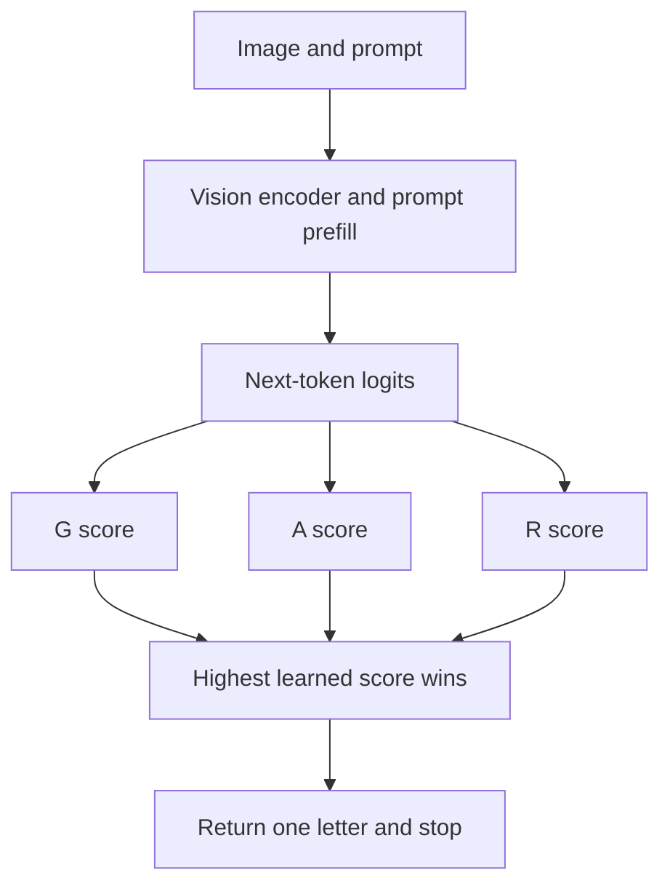

The optimization removes the long-answer portion of inference:

| General prompting | SpeedV1 optimization |
|---|---|
| Ask the model to reason and write several fields | Ask one fixed visual classification question |
| Optionally generate hidden reasoning | `enable_think=false` |
| Decode an answer token by token | Decode one token |
| Parse and validate model-written JSON | Map one letter in deterministic client code |
| Retry or ask a secondary question when fields disagree | No secondary prompt |
| Spend model time repeating labels and explanation text | Build labels and UI text without the model |

This does not eliminate the vision encoder or initial prompt processing. On the EVK those fixed costs still dominate time to first token. It does eliminate nearly all autoregressive answer decoding, avoids a second model call, reduces transport and parsing, and makes the output much harder to format incorrectly.

The tradeoff is deliberate specialization. This SpeedV1 fine-tune should answer only the frozen parcel-safety contract; arbitrary warehouse questions still need a general Reason2 model and normal generated answers.

#### What speed did this buy?

There is no perfectly controlled answer-length-only benchmark: SpeedV1 also uses a shorter prompt, fewer visual tokens, a new fine-tuned checkpoint, and a new EVK serving path. The following measurements are therefore best read as **closest practical comparisons**, not as proof that every millisecond came from choosing one logit.

The closest host comparison used the same Cosmos Reason2 2B family, BF16 weights, synchronized 180-image validation task, and perfect 180/180 accuracy:

| Host validation path | Output | Image | Warm mean | Approx. serial throughput |
|---|---:|---:|---:|---:|
| Compact JSON | 14 tokens | 512 × 288 | 294.3 ms | 3.4 requests/s |
| SpeedV1 BF16 | 1 token | 448 × 256 | 58.9 ms | 17.0 requests/s |

That is approximately **5.0× faster**, or an **80% latency reduction**. It is the most useful comparison, but it combines one-token output with the smaller 112-visual-token input and the SpeedV1 fine-tune.

A broader Q8 historical comparison shows the cost of the original verbose contract more dramatically:

| Host Q8 path | Average output | Warm mean | Accuracy |
|---|---:|---:|---:|
| Older six-field JSON | 48.6 tokens | 939.2 ms | 91.1% |
| SpeedV1 one-letter answer | 1 token | 64.6 ms | 100% |

This is **14.5× faster** in the recorded runs, but it is not an A/B test: the checkpoint, prompt, input geometry, runtime build, and evaluation panel also changed. It demonstrates the overall direction of the optimization work rather than the isolated value of one-token decoding.

On the EVK, an earlier pre-SpeedV1 path averaged 1,701.0 ms per request. SpeedV1 averages 687.3 ms warm, improving serial throughput from roughly 0.59 to 1.46 requests per second: about **2.5× faster** and a **60% latency reduction**. This is likewise an end-to-end comparison, including GenieX, resident QAIRT graphs, direct PNG transport, CL512 context, and fewer visual tokens.

The streamed EVK measurements also expose the remaining floor:

```text
image encoding + prompt prefill + first-token readiness: about 589 ms
returning the selected one-token answer after TTFT:     about  98 ms
total warm request:                                    about 687 ms
```

At the measured EVK decode rate, every additional serial output token would cost roughly another 0.1 seconds. A 14-token JSON answer could therefore add about 1.3 seconds beyond the first-token result if decoding scaled linearly. This shows why avoiding generated prose and JSON matters much more on the edge NPU than on the RTX host.

### Controls and HUD

| Input | Action |
|---|---|
| WASD or arrows | Drive and steer |
| Xbox RT/LT | Forward/reverse |
| Xbox left stick | Steer |
| Q/E or D-pad up/down | Raise/lower forks |
| Space or Xbox A | Brake |
| X | Reset the scene |
| Mouse or right stick | Orbit camera |
| Mouse wheel or View | Zoom/cycle view preset |
| B or Start | Switch host GPU / EVK NPU |
| I | Toggle inference |
| F6 | Toggle Lumen |
| F7 | Toggle runtime ray tracing |
| F8 | Toggle collision diagnostics |
| F9 | Toggle the red sensor-view projection |
| F11 or Alt+Enter | Toggle fullscreen |


### How SpeedV1 was created and served on the EVK

SpeedV1 is a task-specific fine-tune of Cosmos-Reason2-2B. Instead of teaching the model to describe the warehouse, the training objective teaches one fixed mapping:

```text
lossless conveyor image + production prompt -> G, A, or R
```

#### Model fine-tuning and LoRA adapters

Fine-tuning means continuing the training of a pretrained model on examples for a particular task. An adapter stores a compact set of learned adjustments to that model. Training an adapter is therefore a form of fine-tuning; the relevant comparison is full fine-tuning versus parameter-efficient fine-tuning.

| Aspect | Full fine-tuning | LoRA adapter training |
|---|---|---|
| Parameters updated | All base-model weights | Small added matrices; base weights stay frozen |
| Saved training result | A complete model checkpoint | Adapter weights and configuration, requiring the matching base model |
| Main cost | Gradients and optimizer state for all weights | Much less training state, although the base model must still run |

[LoRA (Low-Rank Adaptation)](https://arxiv.org/abs/2106.09685) represents each selected weight adjustment as the product of two smaller matrices. This reduces the number of trainable parameters and makes task-specific variants cheaper to train and store. The adapter alone cannot perform inference.

SpeedV1 uses LoRA across both visual and language projections, with the base model loaded in BF16. The [training script](https://github.com/eivholt/qai-physics-reasoning/blob/main/scripts/reason2_finetune/train_generative.py) learns the parcel task through those added parameters. The resulting adapter contains the learned changes, while Cosmos-Reason2-2B supplies the underlying model.

After training, a compatible runtime can load the base model and adapter separately, allowing adapters to be switched. Alternatively, LoRA adjustments can be merged into the base weights to produce a standalone checkpoint, as described in the [PEFT merging guide](https://huggingface.co/docs/peft/main/en/conceptual_guides/lora#merge-lora-weights-into-the-base-model). SpeedV1 takes this route: the [merge script](https://github.com/eivholt/qai-physics-reasoning/blob/main/scripts/reason2_finetune/merge_adapter.py) incorporates the adapter before host GGUF conversion and EVK QAIRT export. Production inference therefore requires no separate adapter or PEFT runtime.

Quantization is a separate operation that reduces numerical precision. SpeedV1's host Q8 and EVK W8 text exports are produced after merging; they describe deployment precision, not the fine-tuning method. A small adapter file also does not make the complete deployed model small or automatically accelerate its forward pass.

#### Generate matched synthetic training data

The Unreal client generated 3,000 balanced 448 × 256 lossless PNG images: 1,000 GREEN, 1,000 AMBER, and 1,000 RED.

The images were organized as 1,000 matched G/A/R triplets. Within each triplet, parcel identity, camera position, lighting, and scene distractors remain synchronized while the parcel-support geometry changes. This reduces the chance that the model learns incidental correlations such as a particular carton texture, worker position, or lighting condition instead of the physical distinction between supported, overhanging, and fallen parcels.


The retained [dataset capture script](https://github.com/eivholt/qai-physics-reasoning/blob/main/scripts/reason2_finetune/generate_unreal_dataset.ps1) supports matched triplets and unsafe cases on both sides of the conveyor. For example, from the repository root in PowerShell:

```powershell
.\scripts\reason2_finetune\generate_unreal_dataset.ps1 `
  -Split train `
  -CasesPerClass 1000 `
  -MatchedBoundarySweeps `
  -Bilateral
```

This illustrates the capture entry point; reproducing the accepted run requires the synchronized-v22 datasets referenced by the training and evaluation wrappers. Validation and independent test images were generated separately with different deterministic seeds. These frozen sets were not used for training.

#### Fine-tune the visual and language projections

Every training record contains the same user-only production prompt used by the Unreal client. There is no system prompt, hidden-reasoning target, explanatory answer, or secondary request. The completion is exactly one tokenizer token: `G`, `A`, or `R`.

The production [training wrapper](https://github.com/eivholt/qai-physics-reasoning/blob/main/scripts/reason2_finetune/train_evk_speed_v1.sh) runs from the repository root in Bash:

```bash
bash scripts/reason2_finetune/train_evk_speed_v1.sh
```

It performs one epoch of BF16 LoRA supervised fine-tuning with:

- 3,000 matched images, balanced across the three classes;
- 448 × 256 inputs, corresponding to 112 visual tokens;
- LoRA rank 32 over both visual and language projections;
- batch size 4 with two gradient-accumulation steps;
- learning rate `1e-4` and deterministic seed `20260819`;
- completion-only loss, so the model is trained on the answer rather than the repeated prompt.

Adapting the vision projections matters here: the difficult boundary is geometric—whether the carton bottom is still supported by the rollers—not merely linguistic.

The adapter completed with a training loss of `0.0275541`. Before export it passed the frozen host gates:

| Gate | Result |
|---|---:|
| Validation | 180/180 |
| Independent test | 90/90 |
| Per-class recall | 100% for G, A, and R |

The reproducible [evaluation wrapper](https://github.com/eivholt/qai-physics-reasoning/blob/main/scripts/reason2_finetune/evaluate_evk_speed_v1.sh) runs both frozen sets:

```bash
bash scripts/reason2_finetune/evaluate_evk_speed_v1.sh
```

See the [fine-tuning README](https://github.com/eivholt/qai-physics-reasoning/blob/main/scripts/reason2_finetune/README.md) for the retained workflow. The wrappers reference local datasets, checkpoints, and prepared Python environments; these large artifacts are stored outside Git, and their paths must be configured for another workstation.

#### Convert the adapter into an EVK bundle

The LoRA adapter cannot be served directly by the production EVK runtime. The export pipeline therefore:

1. merges the adapter into the Cosmos-Reason2-2B checkpoint;
2. prepares task-matched 448 × 256 vision calibration data;
3. builds a context-length-512 QAIRT checkpoint;
4. retains the complete Qwen3-VL DeepStack interface;
5. converts the text matrices to the accepted W8 precision;
6. exports the five QAIRT contexts required by GenieX: one vision encoder and four text partitions;
7. packages the graphs, tokenizer metadata, and compatibility manifest.

The retained [EVK build script](https://github.com/eivholt/qai-physics-reasoning/blob/main/scripts/reason2_finetune/build_evk_speed_v1.sh) checks the host accuracy gates before exporting:

```bash
bash scripts/reason2_finetune/build_evk_speed_v1.sh
```

Its production output is:

```text
cosmos-reason2-parcel-speed-v1-cl512-256x448-w8text-geniex-qairt245-os19-r1
```

The bundle targets the Dragonwing IQ-9075 EVK, QAIRT 2.45, Hexagon v73, and EVK OS 1.9. The context length is deliberately limited to 512 because the application supplies only one compact prompt, one image, and one output token. This is a compiled QAIRT bundle; the host Q8 GGUF is a separate export of the same fine-tune.

#### Serve it with one resident GenieX worker

The production provisioner imports the bundle into the GenieX data directory:

```text
/home/ubuntu/qai-conveyor/geniex-data/cosmos-reason2-parcel-speed-v1
```

The [systemd service](https://github.com/eivholt/qai-physics-reasoning/blob/main/unreal_conveyor_demo/Provisioner/evk-services/qai-conveyor-geniex.service) keeps one GenieX v0.3.17 QAIRT worker resident. Its launch arguments are:

```bash
geniex-grammar --skip-update serve \
  --host 0.0.0.0:18183 \
  --keepalive 3600 \
  --compute npu \
  --nctx 512 \
  --ngl -1
```

The service also sets the model data directory, runtime plugin paths, matching QAIRT 2.45 libraries, and Hexagon v73 DSP library path. These settings are part of deployment; the command above shows the worker arguments rather than a standalone installation procedure.

Keeping the worker resident avoids reloading the model and reacquiring the HTP device for every observation. Exactly one worker is allowed to own the model: the [candidate-gate script](https://github.com/eivholt/qai-physics-reasoning/blob/main/scripts/run_evk_geniex_candidate_gate.sh) stops the production service, tests a candidate on a temporary port, and restores production afterward.

At runtime the Unreal client sends the lossless PNG directly inside the OpenAI-compatible `/v1/chat/completions` request as a `data:image/png;base64,...` item, followed by the production prompt. GenieX decodes the embedded image and runs the resident QAIRT graphs. There is no media bridge, shared-file polling, or per-request GenieX process.

The returned assistant content is one letter:

```text
G
```

The client then maps that token to GREEN, AMBER, or RED. Longer labels and UI fields are constructed deterministically without another model call.

#### Promotion gates

The final bundle passed every frozen class gate and a sustained resident-service soak:

| Gate | Result |
|---|---:|
| Host validation | 180/180 |
| Host independent test | 90/90 |
| EVK direct embedded-image test | 90/90 |
| EVK sustained soak | 360/360 |
| Packaged EVK in-scene smoke | 9/9 |
| Packaged host in-scene smoke | 9/9 |

The EVK direct-image test measured a 685.4 ms warm mean and 694.0 ms p95. Across the 360-request soak, the warm mean was 687.3 ms and p95 was 691.0 ms, with no classification failures. The soak repeats the frozen 90-image panel four times to test sustained operation; it is not a separate set of 360 unique images.

The canonical records are the [90-image EVK gate](https://github.com/eivholt/qai-physics-reasoning/blob/main/docs/evidence/results/geniex_speed_v1_direct_stream_test90_20260819.json), [360-request soak](https://github.com/eivholt/qai-physics-reasoning/blob/main/docs/evidence/results/geniex_speed_v1_direct_stream_soak360_20260819.json), and [packaged production smoke](https://github.com/eivholt/qai-physics-reasoning/blob/main/docs/evidence/results/packaged_speed_v1_production_defaults_smoke9_20260819.json).

SpeedV1 should therefore be treated as a specialized visual classifier, not as a replacement for general Cosmos Reason2. Its accuracy and speed depend on preserving the frozen camera, image geometry, prompt, and G/A/R contract.

# Conclusion
As demonstrated, edge-deployable physics-aware VLMs push computer vision to the next level, enabling applications hardly imaginable only a few years ago. These VLMs are easy to experiment with using generic prompts, and they can be specialized for improved performance and speed before deployment. Custom built simulations, by hand or by coding agents, makes experimentation quick and cheap and can smoke out many problems before meeting the real world.

# Appendix

## Plumbing a MCP server to Isaac Sim, for AI coding agents
Isaac Sim unfortunately does not ship with native MCP servers. It does however contain a Python server that can execute any code.

To allow OpenAI Codex to edit a Omniverse scene, an integration was implemented as a local MCP server in integrations/isaac_sim_mcp/server.py: Codex invokes a set of narrowly scoped MCP tools for operations such as inspecting the USD stage, configuring actors, advancing navigation, capturing cameras, and saving checkpoints; the server validates each request, generates a bounded Python snippet, and sends it over TCP to Isaac Sim’s built-in isaacsim.code_editor.python_server on 127.0.0.1:8226. That code executes inside the running Isaac Sim process using omni.usd, omni.timeline, Isaac navigation nodes, Replicator render products, and USD APIs, then returns JSON through the TCP connection and MCP bridge. Scene edits are constrained primarily to /World/CodexPoC, captures and checkpoints are restricted to repository artifact directories, and the launcher enables the Isaac Python endpoint, registers the Omniverse supervisor extension, and applies the 60 FPS cap.

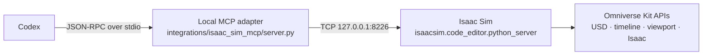
Codex does not receive a general-purpose remote Python tool. The MCP server
publishes an explicit set of JSON-schema tool definitions, validates their
arguments, and maps each call to a predefined source builder. The generated
code runs inside Isaac Sim, where it can use `omni.usd`, `omni.timeline`,
viewport utilities, and Isaac controllers. Results are serialized back as
JSON and returned as the MCP tool result. This keeps the agent-facing surface
small even though the final operation executes in Omniverse Kit.

The main code references are:

| Component | Purpose |
| --- | --- |
| [`.codex/config.toml`](https://github.com/eivholt/qai-physics-reasoning/blob/main/.codex/config.toml) | Registers the local stdio MCP process when a Codex task starts. |
| [`server.py`](https://github.com/eivholt/qai-physics-reasoning/blob/main/integrations/isaac_sim_mcp/server.py#L98) | Implements the loopback TCP client, MCP tool schemas, argument validation, dispatch, and stdio JSON-RPC loop. |
| [`live_aisle_supervisor.py`](https://github.com/eivholt/qai-physics-reasoning/blob/main/integrations/isaac_sim_mcp/live_aisle_supervisor.py#L163) | Builds the bounded USD, camera, navigation, capture, and advisory operations used by this demo. |
| [`edge_supervisor.py`](https://github.com/eivholt/qai-physics-reasoning/blob/main/integrations/isaac_sim_mcp/edge_supervisor.py#L900) | Builds the lightweight warehouse and related camera operations. |
| [`launch_isaac_sim_poc.ps1`](https://github.com/eivholt/qai-physics-reasoning/blob/main/integrations/isaac_sim_mcp/launch_isaac_sim_poc.ps1#L26) | Starts Isaac Sim with the localhost Python server and tutorial extensions enabled. |
| [`qai.edge_ai_supervisor`](https://github.com/eivholt/qai-physics-reasoning/blob/main/isaac_sim_supervisor_omniverse/exts/qai.edge_ai_supervisor/qai/edge_ai_supervisor/extension.py#L89) | Implements the in-viewport supervisor panel; it is loaded into Kit but is not the MCP transport. |

To reproduce the setup, register the server in the repository's
`.codex/config.toml`. Replace `<REPO ROOT>` with the absolute checkout path:

```toml
[mcp_servers.isaac_sim_control]
enabled = true
required = false
command = "python"
args = ["-u", "integrations/isaac_sim_mcp/server.py"]
cwd = "<REPO ROOT>"
env = { ISAAC_SIM_HOST = "127.0.0.1", ISAAC_SIM_PORT = "8226" }
startup_timeout_sec = 10.0
tool_timeout_sec = 60.0
```

Launch Isaac Sim from the repository and check the application-level bridge:

```powershell
.\integrations\isaac_sim_mcp\launch_isaac_sim_poc.ps1

# Run this in a second terminal after the Isaac Sim UI is responsive.
python .\integrations\isaac_sim_mcp\server.py --check-isaac
```

Codex reads MCP configuration when a task starts, so open a new Codex task or
restart the current one after changing the configuration. A useful first
request is: “Ping Isaac Sim, report the stage status, and list the prims under
`/World/CodexPoC`.” The complete tool inventory and a minimal scene exercise
are in the [bridge README](https://github.com/eivholt/qai-physics-reasoning/blob/main/integrations/isaac_sim_mcp/README.md).

Keep the Isaac Python server bound to `127.0.0.1`. Its native protocol can
execute Python inside Kit and must not be exposed directly to a LAN. The MCP
adapter adds a bounded tool interface, but loopback binding remains the
primary network-security boundary.
