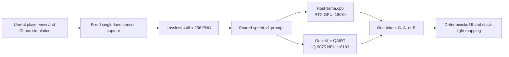
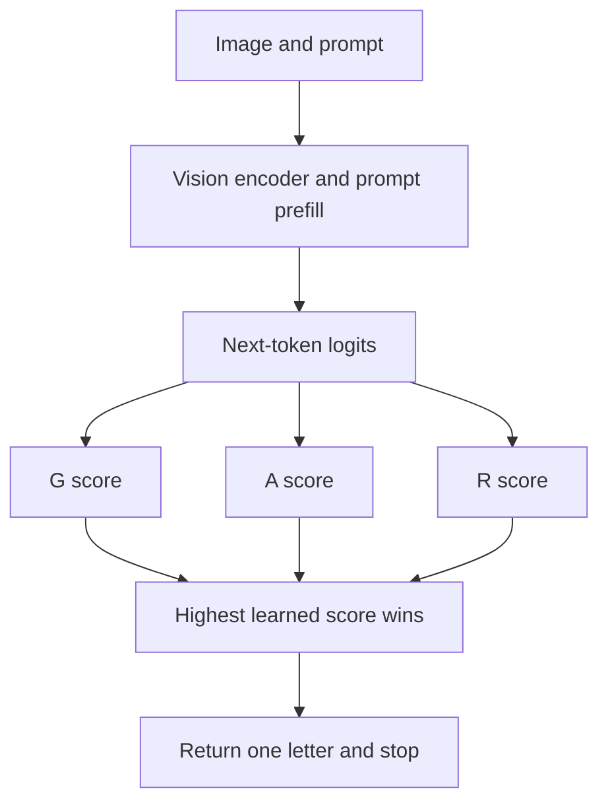

# Cosmos Reason2 conveyor demo: from Isaac/Omniverse to packaged Unreal

This tutorial describes the current parcel-safety demonstration as of
2026-08-20. The project began as a live Isaac Sim warehouse experiment. Isaac
Sim and NVIDIA Omniverse remain the source of the warehouse and conveyor
assets, but the interactive release is now a packaged Unreal Engine 5.8
application with native Chaos physics and two interchangeable Reason2
backends.

The current release is a narrow visual classifier, not the earlier forklift
clearance prototype. A fixed sensor observes one straight conveyor lane and
asks whether its cartons are safe, over an edge, or fallen. The same image and
prompt contract run on an RTX host GPU and a Dragonwing IQ-9075 EVK NPU.

## Current release at a glance

| Part | Current implementation |
|---|---|
| Interactive client | Unreal Engine 5.8.1, Win64 Shipping |
| Scene source | NVIDIA Omniverse warehouse, forklift, worker, rack, and conveyor assets |
| Monitored area | One central silver straight conveyor lane |
| Input | One lossless 448 × 256 PNG from a fixed 62-degree end-oblique camera |
| Task | `G` fully supported, `A` over-edge/tipping, `R` fallen |
| Host | `Cosmos-Reason2-2B-Parcel-Speed-v1`, llama.cpp, port 18084 |
| EVK | `local/cosmos-reason2-2b`, GenieX + QAIRT on the NPU, port 18183 |
| Inference strategy | Read one trained next-token decision instead of generating a reasoned answer |
| Rendering | D3D12, hardware Lumen and ray tracing enabled by default |
| Default window | 1600 × 900 windowed; F11 or Alt+Enter toggles fullscreen |
| Release executable | `unreal_conveyor_demo/Saved/Packaged/Win64/Windows/QaiConveyor.exe` |

The current build retains only one drivable forklift. The unused second
forklift, its bindings, and its runtime resources have been removed.

## Architecture



The capture, prompt, parser, class mapping, and operator presentation are
shared. Pressing B or Start changes only the endpoint and model identity. This
makes the comparison about execution hardware rather than prompt drift.

Exactly one request may be in flight. Live capture is demand-driven and pauses
while the model is busy. Without an explicit benchmark override, the client
allows up to 1.5 new host observations per second and 0.75 EVK observations per
second. Simulation and presentation rendering continue independently.

## Parcel-safety policy

The client classifies the most unsafe monitored carton:

| Token | UI state | Meaning |
|---|---|---|
| `G` | GREEN / SAFE | Every monitored carton is fully supported by the rollers. Rotation and diagonal yaw are safe while the bottom remains supported. |
| `A` | AMBER / UNSTABLE_PARCEL | A carton still touches the rollers, but roughly one third or more extends beyond a blue rail, or the carton is visibly tipping. |
| `R` | RED / FALLEN_PARCEL | A carton is on the adjacent floor below roller-top height. RED has priority over AMBER. |

Workers, the forklift, wooden pallets, shelving, lights, and the separated
return lane are not classification targets. The helmetless worker deliberately
walks partly through the sensor view to demonstrate that ordinary scene
context is ignored.

The HUD shows two states:

- **Simulator state** is the deterministic Chaos ground truth used to evaluate
  the demo.
- **Reason2** is the confirmed model decision that drives the presentation
  stack lights.

The client requires two consecutive matching model observations before it
changes the confirmed Reason2 state. This suppresses one-frame flicker without
silently replacing the model decision with simulator geometry.

## Exact production prompt

Both GPU and EVK receive this exact user message:

```text
Classify cartons at the central silver conveyor lane. Ignore all other objects and lanes. Answer one letter only: G=fully supported; A=touching rollers but at least one-third beyond a blue rail or tipping; R=on the adjacent floor below the rollers.
```

There is no system message and no secondary prompt in the production
`speed-v1` profile. Each request uses:

```text
temperature: 0
top_k: 1
seed: 42
enable_think: false
max_completion_tokens: 1
```

The lossless PNG is embedded directly as a `data:image/png;base64,...` item in
an OpenAI-compatible `/v1/chat/completions` request. The text is the second and
final content item. The host and EVK receive the same content ordering.

### Why a one-token logit decision is faster

A general vision-language model normally behaves like a writer. After it has
processed the image and prompt, it predicts the first word or symbol, appends
that result to its context, runs the text decoder again for the next token,
and repeats. A reasoned explanation or six-field JSON object can therefore
require dozens or hundreds of sequential decoder steps. Each step depends on
the preceding step, so they cannot all be calculated at once.

Before choosing a token, the model assigns every possible next token a numeric
score called a **logit**. A higher logit means that token is currently a more
likely continuation. A softmax can turn the logits into probabilities, but
the ordering is already sufficient for a deterministic classification.

SpeedV1 turns this next-token choice into the task's decision surface. During
fine-tuning, every image is completed with exactly one class token:

```text
safe image       -> G
over-edge image  -> A
fallen image     -> R
```

At runtime, `temperature=0` and `top_k=1` select the token with the highest
logit, and `max_completion_tokens=1` stops immediately afterward. Fine-tuning
makes `G`, `A`, and `R` the learned valid answers for this exact prompt. The
API still returns the selected one-letter token; the client does not transfer
or parse the complete raw logit vector.



The optimization removes the long-answer portion of inference:

| General prompting | SpeedV1 production path |
|---|---|
| Ask the model to reason and write several fields | Ask one fixed visual classification question |
| Optionally generate hidden reasoning | `enable_think=false` |
| Decode an answer token by token | Decode one token |
| Parse and validate model-written JSON | Map one letter in deterministic client code |
| Retry or ask a secondary question when fields disagree | No secondary prompt |
| Spend model time repeating labels and explanation text | Build labels and UI text without the model |

This does not eliminate the vision encoder or initial prompt processing. On
the EVK those fixed costs still dominate time to first token. It does eliminate
nearly all autoregressive answer decoding, avoids a second model call, reduces
transport and parsing, and makes the output much harder to format incorrectly.

The tradeoff is deliberate specialization. This SpeedV1 release should answer
only the frozen parcel-safety contract; arbitrary warehouse questions still
need a general Reason2 model and normal generated answers. The runtime does not
hard-mask the full vocabulary, so an unexpected token is rejected rather than
silently converted into a safety state.

### What speed did this buy?

There is no perfectly controlled answer-length-only benchmark: SpeedV1 also
uses a shorter prompt, fewer visual tokens, a new fine-tuned checkpoint, and a
new EVK serving path. The following measurements are therefore best read as
**closest practical comparisons**, not as proof that every millisecond came
from choosing one logit.

The closest host comparison used the same Cosmos Reason2 2B family, BF16
weights, synchronized 180-image validation task, and perfect 180/180 accuracy:

| Host validation path | Output | Image | Warm mean | Approx. serial throughput |
|---|---:|---:|---:|---:|
| Previous v22 compact JSON | 14 tokens | 512 × 288 | 294.3 ms | 3.4 requests/s |
| SpeedV1 BF16 | 1 token | 448 × 256 | 58.9 ms | 17.0 requests/s |

That is approximately **5.0× faster**, or an **80% latency reduction**. It is
the most useful comparison for a reader, but it combines one-token output with
the smaller 112-visual-token input and the SpeedV1 fine-tune.

A broader Q8 historical comparison shows the cost of the original verbose
contract more dramatically:

| Host Q8 path | Average output | Warm mean | Accuracy on its recorded panel |
|---|---:|---:|---:|
| Older six-field JSON | 48.6 tokens | 939.2 ms | 91.1% |
| SpeedV1 one-letter answer | 1 token | 64.6 ms | 100% |

This is **14.5× faster** in the recorded runs, but it is not an A/B test: the
checkpoint, prompt, input geometry, runtime build, and evaluation panel also
changed. It demonstrates the overall direction of the work rather than the
isolated value of one-token decoding.

On the EVK, the accepted pre-SpeedV1 path averaged 1,701.0 ms per request. The
promoted 360-request SpeedV1 soak averaged 687.3 ms warm, improving serial
throughput from roughly 0.59 to 1.46 requests per second: about **2.5× faster**
and a **60% latency reduction**. This is likewise an end-to-end release
comparison, including GenieX, resident QAIRT graphs, direct PNG transport,
CL512 context, and fewer visual tokens.

The streamed EVK measurements also expose the remaining floor:

```text
image encoding + prompt prefill + first-token readiness: about 589 ms
returning the selected one-token answer after TTFT:     about  98 ms
total warm request:                                    about 687 ms
```

At the measured EVK decode rate, every additional serial output token would
cost roughly another 0.1 seconds. A 14-token JSON answer could therefore add
about 1.3 seconds beyond the first-token result if decoding scaled linearly.
That last number is an explanatory extrapolation, not a same-build benchmark,
but it shows why avoiding generated prose and JSON matters much more on the
edge NPU than on the RTX host.

The model emits only `G`, `A`, or `R`. The answer panel displays the mapped
`prediction_answer`, and the client derives the corresponding internal signal
and stack-light state deterministically. The logical mapping is:

```text
R -> fallen_test=YES, unstable_test=NO, class_id=0,
     label=FALLEN_PARCEL, answer=RED
A -> fallen_test=NO, unstable_test=YES, class_id=1,
     label=UNSTABLE_PARCEL, answer=AMBER
G -> fallen_test=NO, unstable_test=NO, class_id=2,
     label=SAFE, answer=GREEN
```

Older prompt profiles remain available only for controlled ablations through
`-QaiParcelPrompt=...`; they are not runtime UI modes and are not part of the
released model contract.

## Scene and sensor progress

### Omniverse conveyor

The visible conveyor is assembled from imported NVIDIA Omniverse conveyor
modules, including the A05, A08, and A11 families. The two end turns use the
Omniverse quarter-turn geometry. The widened return lane requires short
transition bridges; those bridges reuse imported conveyor geometry and the
same anisotropic steel presentation material rather than exposed Unreal basic
shapes.

The current layout includes these corrections:

- the divider wall was removed;
- the unmonitored straight return lane was moved 260 cm farther right so it no
  longer enters the sensor crop;
- the wall, second portal, turns, physical path, support projection, and
  conveyor forces were extended to match the wider loop;
- portals protrude approximately one metre from the wall and have structural
  bounding-box colliders for parcels, props, workers, and the forklift;
- each stack light is centred on a portal roof with wall clearance;
- repeated roller materials are rebound at runtime so custom bridge and A08
  rollers use the same anisotropic steel finish; and
- tall straight-section uprights are visually clipped at roller height while
  their collision remains unchanged, leaving a clear parcel-manipulation view.

The physical centring guide is behind the left portal so it does not become a
visual AMBER cue. Its low arm begins just above the rollers, extends around the
inside of the curve, and removes only velocity directed into the guide. A
localized, acceleration-limited centring assist carries parcels past the
corner without globally snapping them to the belt centre or congesting the
portal.

### Forklift, props, and workers

The forklift now starts near the sorting area, faces the monitored lane, and
has working forks, wheels, contacts, and portal collisions. Its spawn height
was reduced. Startup damping, supported-body vertical damping, and an upward
velocity cap arrest the occasional multi-second launch without making normal
driving rigid. The safety mat is only 0.2 cm thick and does not block the
wheels.

The loose pallet is retained in the scene by the left wall near the shelves.
Worker routes avoid the pallet stack, traverse the thin mat, connect the shelf
and conveyor areas, and include a short sensor-view dwell for the helmetless
worker.

### Sensor view

The production camera variant is
`parcel-quarter-cell-occlusion-safe`. It matches the synchronized v22 training
view: a fixed 62-degree end-oblique composition of the one monitored lane.
Parcels initially spawn near the centre of that lane, so the untouched state
starts GREEN.

The sensor capture excludes presentation-only elements that could leak the
answer, including collision debug, the F9 view visualization, and stack-light
colour. Unmonitored dynamic pallet and forklift primitives inside the
projection are also hidden from the inference capture. The player still sees
the complete warehouse scene.

F9 draws a depth-tested red laser-style representation of the sensor boundary
on the surfaces it intersects. It uses corner brackets and a centre reticle,
does not draw through walls, and is explicitly hidden from the inference
capture.

## Build and run

### Prerequisites

For development and packaging:

- Windows 11;
- Unreal Engine 5.8.1 at `C:\Program Files\Epic Games\UE_5.8`;
- an RTX-capable GPU and current NVIDIA driver for the default D3D12 render
  profile; and
- Python 3 for setup, diagnostics, and dataset scripts.

For EVK inference, the host must also reach an IQ-9075 EVK over SSH and port
18183. The accepted setup uses EVK OS 1.9 and QAIRT 2.45.0.260326.

### Package the Shipping client

From the repository root:

```powershell
powershell -NoProfile -ExecutionPolicy Bypass `
  -File .\unreal_conveyor_demo\Scripts\package_windows_client.ps1 `
  -SmokeTest
```

The script builds Shipping, cooks with the UE 5.8.1 commandlet timing
workaround, stages the pak, and runs a bounded motion smoke test. The cook is
single-threaded only as a workaround; the packaged client remains normally
threaded and retains D3D12, SM6, hardware Lumen, and ray tracing.

The default output is:

```text
unreal_conveyor_demo/Saved/Packaged/Win64/Windows/QaiConveyor.exe
```

### Provision and launch a development package

The provisioner validates the hash-pinned payload, installs or reuses the
SpeedV1 host model and llama.cpp runtime, writes `runtime.json`, optionally
deploys GenieX to the EVK, and launches the game.

```powershell
python .\unreal_conveyor_demo\Provisioner\qai_conveyor_setup.py ensure `
  --app-dir .\unreal_conveyor_demo\Saved\Packaged\Win64\Windows `
  --payload-root .\unreal_conveyor_demo\Provisioner\Payload `
  --evk-host 192.168.1.158 `
  --require-evk

python .\unreal_conveyor_demo\Provisioner\qai_conveyor_setup.py launch `
  --app-dir .\unreal_conveyor_demo\Saved\Packaged\Win64\Windows `
  --payload-root .\unreal_conveyor_demo\Provisioner\Payload
```

Normal `launch` reuses the configured EVK endpoint and does not scan or
redeploy it. Run `ensure` when the EVK installation needs repair.

For host-only development under WSL, the repository launcher starts the
release-specific GPU endpoint:

```bash
./scripts/start_host_cosmos_reason2_server.sh
```

Verify the endpoints before testing:

```powershell
Invoke-RestMethod http://127.0.0.1:18084/v1/models
Invoke-RestMethod http://192.168.1.158:18183/v1/models
```

The host response must contain `Cosmos-Reason2-2B-Parcel-Speed-v1`; the EVK
response must contain `local/cosmos-reason2-2b`.

### Runtime configuration and overrides

The provisioner writes:

```text
%LOCALAPPDATA%/QaiConveyorDemo/runtime.json
```

Its normal defaults are host inference enabled, host port 18084, EVK port
18183, and 448 × 256 capture for both backends. Useful one-run overrides are:

```text
-Backend=host|evk
-HostServer=http://127.0.0.1:18084
-HostModel=Cosmos-Reason2-2B-Parcel-Speed-v1
-EvkServer=http://192.168.1.158:18183
-EvkModel=local/cosmos-reason2-2b
-NoInference
```

Use capture-size and prompt overrides only for explicit experiments. Changing
them breaks the frozen production input contract.

## Controls and HUD

| Input | Action |
|---|---|
| WASD or arrows | Drive and steer |
| Xbox RT/LT | Forward/reverse |
| Xbox left stick | Steer |
| Q/E or D-pad up/down | Raise/lower forks |
| Space or Xbox A | Brake |
| X | Reset the scene |
| Mouse or right stick | Orbit camera |
| Mouse wheel or View | Zoom/cycle view preset |
| B or Start | Switch host GPU / EVK NPU |
| I | Toggle inference |
| F6 | Toggle Lumen |
| F7 | Toggle runtime ray tracing |
| F8 | Toggle collision diagnostics |
| F9 | Toggle the red sensor-view projection |
| F11 or Alt+Enter | Toggle fullscreen |

The always-visible status block clearly labels `HOST GPU` or `EVK NPU`, the
model identity, busy state, and latency. The current inference image and model
answer are aligned at the lower left. UI backgrounds are translucent, while
text and the preview image remain opaque.

The controls are an independent drawer. Any user input retracts it off-screen;
after ten idle seconds it eases back into view to help an unattended viewer
without covering the active demonstration.

## Model training and measured result

SpeedV1 was trained from the synchronized v22 Unreal sensor corpus:

- 3,000 balanced training images: 1,000 GREEN, 1,000 AMBER, and 1,000 RED;
- matched scene triplets that change support geometry while preserving parcel
  identity, camera, lighting, and distractors;
- substantial safe and unsafe parcel yaw variation, including boxes displaced
  by fork contact;
- AMBER examples covering horizontal overhang, mild tilt, and active tipping
  on both sides of the lane; and
- the exact production camera, 448 × 256 input, user-only prompt, and one-token
  completion.

This training target is what makes the one-token optimization reliable: the
model learned to place the correct class token at the top of its next-token
logits instead of learning to compose a long answer whose fields happen to
contain the same decision.

The adapter completed one epoch with training loss 0.0275541. Frozen host
gates passed 180/180 validation and 90/90 independent test images, with perfect
per-class recall. The released Q8 host conversion retained those gates and is
smaller than BF16.

The final full-DeepStack CL512/W8 QAIRT bundle passed:

| Gate | Result |
|---|---:|
| Host validation | 180/180 |
| Host independent test | 90/90 |
| EVK direct-image gate | 90/90 |
| EVK sustained soak | 360/360 |
| Packaged EVK in-scene smoke | 9/9 |
| Packaged host in-scene smoke | 9/9 |

Representative warm performance on the accepted artifacts:

| Backend | Measured latency |
|---|---:|
| Host Q8 direct model | about 66.7 ms mean |
| Packaged host client | about 113 ms client-observed mean |
| EVK GenieX direct-image test | 685.4 ms mean, 694.0 ms p95 |
| EVK 360-request soak | 687.3 ms mean, 691.0 ms p95 |

The preceding one-token section compares these figures with the earlier JSON
paths and separates measured results from explanatory estimates.

The promoted EVK service is `qai-conveyor-geniex.service`. It runs one resident
GenieX v0.3.17 QAIRT worker on port 18183 and accepts the embedded PNG directly.
The former media bridge, file polling, forced connection close, and active
legacy Genie deployment were removed after the accuracy, soak, and packaged
client gates passed. One labelled rollback remains outside the active payload.

## Resource and stability work

The current client includes six deliberate runtime savings:

1. demand-driven sensor capture stops while inference is busy;
2. settled stack lights do no per-frame render-state work, and 18 permanently
   dark spotlights were removed;
3. tiny non-contributing geometry is excluded from the ray-tracing scene;
4. repeated static meshes use hierarchical instancing with clustered frustum
   and 30–45 m distance culling;
5. worker decisions run at 30 Hz and safety evaluation at 15 Hz rather than on
   every 120 Hz physics step, while skeletal poses tick only when rendered; and
6. non-Ultra tiers use coarser fog grids, HZB fog culling, and smaller local
   shadow budgets.

On the RTX path, animated workers and drivers are rasterized but excluded from
the hardware ray-tracing acceleration structure. Hardware Lumen still traces
the static warehouse. D3D12 asynchronous compute is disabled and the first RT
material pipeline compiles synchronously to avoid the observed RTX 5090
multi-queue timing crash without disabling Lumen or ray tracing.

When GPU saturation slows presentation frames, Chaos still advances with
bounded substeps. The forklift also has startup damping, suspension damping,
idle driveline drag, and a supported-body vertical stabilizer so rendering
load does not turn a small contact error into a prolonged bounce.

## Verification and distribution

Run the source contract tests:

```powershell
python -m unittest tests.test_unreal_reason2_contract
Push-Location .\unreal_conveyor_demo\Provisioner
try {
  python -m unittest discover -s tests
} finally {
  Pop-Location
}
```

Run the packaged nine-case inference gate against either backend:

```powershell
$client = '.\unreal_conveyor_demo\Saved\Packaged\Win64\Windows\QaiConveyor.exe'

powershell -NoProfile -ExecutionPolicy Bypass `
  -File .\unreal_conveyor_demo\Scripts\smoke_packaged_speed_v1.ps1 `
  -ClientExecutable $client -Backend host

powershell -NoProfile -ExecutionPolicy Bypass `
  -File .\unreal_conveyor_demo\Scripts\smoke_packaged_speed_v1.ps1 `
  -ClientExecutable $client -Backend evk
```

The smoke script requires nine correct classifications, a clean automatic
exit, and no new Unreal crash report. It also restores the previous user window
settings.

For another Windows computer, distribute the complete release rather than
only `QaiConveyor.exe`: the staged `Game`, hash-pinned `Payload`, and setup
launcher belong together. The setup launcher installs the correct model and
runtime, writes the local endpoint configuration, discovers or provisions the
EVK, and creates a redacted support bundle if setup fails.

Diagnostics and logs live below:

```text
%LOCALAPPDATA%/QaiConveyorDemo/Logs/
%LOCALAPPDATA%/QaiConveyorDemo/Support/
%LOCALAPPDATA%/QaiConveyor/Saved/Crashes/
```

## Short failure history

- The Isaac live Python loop made capture, physics, and distribution too
  coupled; the production client moved to native Unreal while retaining the
  Omniverse assets.
- Two-frame and secondary-prompt policies were slower and less stable than the
  visible support relation; production now uses one image and one token.
- Broad or two-lane sensor views encouraged context errors; the camera and
  scene were rebuilt around one lane and synchronized training pixels.
- Early datasets had crop and parcel-interpenetration defects; synchronized
  v22 replaced them.
- Legacy Genie upload and polling added latency and failure modes; GenieX now
  receives the PNG directly and keeps one QAIRT graph resident.
- Skeletal RT geometry and asynchronous D3D12 queues correlated with client
  crashes; those paths were isolated while hardware Lumen remained enabled.

## Evidence

The principal release records are:

- [`geniex_speed_v1_direct_stream_test90_20260819.json`](evidence/results/geniex_speed_v1_direct_stream_test90_20260819.json)
- [`geniex_speed_v1_direct_stream_soak360_20260819.json`](evidence/results/geniex_speed_v1_direct_stream_soak360_20260819.json)
- [`packaged_speed_v1_final_model_smoke9_20260819.json`](evidence/results/packaged_speed_v1_final_model_smoke9_20260819.json)
- [`packaged_speed_v1_production_defaults_smoke9_20260819.json`](evidence/results/packaged_speed_v1_production_defaults_smoke9_20260819.json)
- [`host_q8_speed_v1_deployment_smoke9_20260819.json`](evidence/results/host_q8_speed_v1_deployment_smoke9_20260819.json)
- [`packaged_host_speed_v1_deployment_defaults_smoke9_20260819.json`](evidence/results/packaged_host_speed_v1_deployment_defaults_smoke9_20260819.json)
- [`host_bf16_gguf_evk_single_lane_v22_v1_validation180_20260818.json`](evidence/results/host_bf16_gguf_evk_single_lane_v22_v1_validation180_20260818.json)
- [`host_bf16_speed_v1_validation180_20260819.json`](evidence/results/host_bf16_speed_v1_validation180_20260819.json)
- [`host_q8_observable_hard_v1_reverified_test90_20260816.json`](evidence/results/host_q8_observable_hard_v1_reverified_test90_20260816.json)
- [`host_q8_0_speed_v1_test90_20260819.json`](evidence/results/host_q8_0_speed_v1_test90_20260819.json)
- [`evk_single_lane_v22_v1_candidate_validation90_20260818.json`](evidence/results/evk_single_lane_v22_v1_candidate_validation90_20260818.json)

This is a demonstration and evaluation system. A production conveyor must keep
an independent, conventional hard safety interlock; the visual model and stack
lights are not a machinery safety certification.
