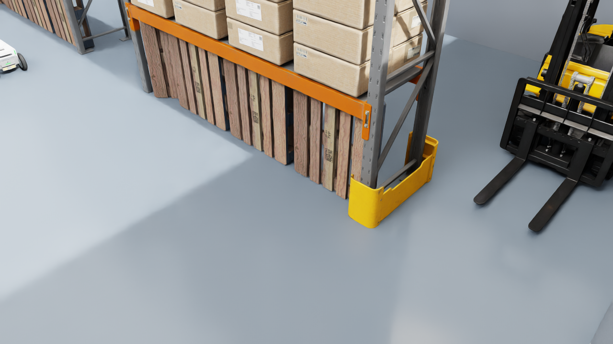
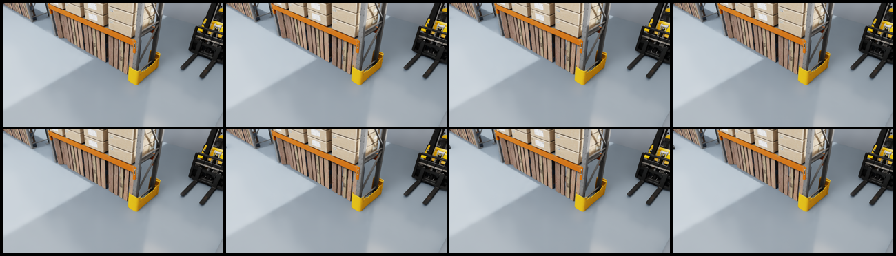
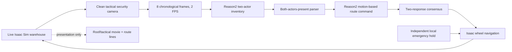
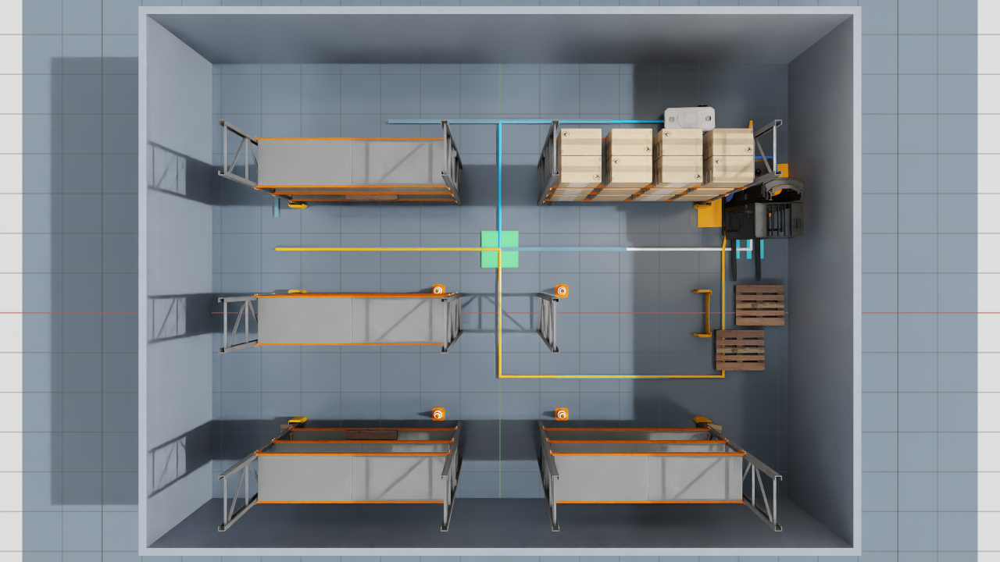
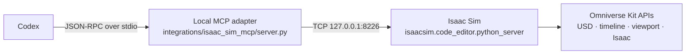

# Camera-only edge AI warehouse supervisor in Isaac Sim

**Author:** [Eivind Holt](https://www.linkedin.com/in/eivholt/), July 2026  

**Repository:** [github.com/eivholt/or-edge-agent](https://github.com/eivholt/qai-physics-reasoning)  

**Target:** [Qualcomm Dragonwing IQ-9075 EVK / QCS9075 / Hexagon v73](https://www.qualcomm.com/developer/hardware/qualcomm-iq-9075-evaluation-kit-evk). Hardware generously sponsored by Qualcomm

**Model:** [nvidia/Cosmos-Reason2-2B](https://huggingface.co/nvidia/Cosmos-Reason2-2B) running on device NPU

Physical-aware Visual Language Models can, in addition to identifying objects, reason whats happening in a camera feed and even what's likely to happen. As edge devices get more capable and we are able to compress these models, new possibilities arise in traditional sensor applications. However, experimenting and testing new ideas can be impractical and require for instance actors, forklifts and a warehouse.

## Live simulation

With mature simulation tools at our disposal, almost any scenario can be simulated. NVIDIA Omniverse Isaac Sim for instance, can the run a live simulation where we can stress test our application. We can connect our application or bare model hosted on an edge device to a simulation by sending a video feed (or any modality) to a device. Inference results can be returned and affect the simulation.

This tutorial runs a live warehouse in Isaac Sim 6.0.1, continuously sends
clean security-camera images to Cosmos-Reason2-2B on a Dragonwing IQ-9075 EVK,
and lets model output change a simulated robot's active navigation route.

In this demonstration the model running on EVK only ever sees camera feed and a prompt.

## Demo

In this demo we explore if an AI supervisor, extra eyes in the sky, could optimize autonomous logistics vehicles by communicating potential congestions or hazards the AMRs are unable to detect in time. The supervisor could have as many cameras as needed, placed at strategic point. To test this out a rudamentary warehouse was constructed in Isaac Sim, using standard assets. An autonomous vehicle, RobotBlue, was placed in an aisle and configured to use path finding to reach an endpoint. Several alternatice paths were defined and the supervisor is able to signal that an alternative route is better if it sees a potential congestion in the standard route.

This tutorial does not cover steps in creating a simulation in Omniverse. One may opt to leave this to a coding agent, see appendix for setting up a MCP bridge with Omniverse APIs.

| Demonstration | EVK responses | Applied behavior | Destination |
| --- | ---: | --- | --- |
| Clear-route | 37 | stayed on the direct route | northwest goal reached |
| Blind-corner congestion | 15 | two-vote EVK north reroute before RobotBlue can see the forklift | bypass goal reached |

The EVK endpoint exposed `local/cosmos-reason2-2b:Q4_0`. The archived
closed-loop run used an ordinary H.264 eight-frame, four-second video at
384 × 216 and 2 FPS. The current runner replaces that model-bound encoding
with pixel-lossless RGB H.264; the archived behavior counts below have not yet
been rerun under the new codec profile.

### Historical frame-count sweep

These archived reruns used the earlier tactical-camera placement, the same
compact two-actor inventory, 2 FPS encoding, a three-response gateway, and
bounded actions. Eight frames was the only reduced operating point whose
hazard and clear trials both passed:

| Frames / history | Hazard mean / P95 | Clear mean / P95 | Full-run result |
| --- | ---: | ---: | --- |
| 12 / 6 s | 8.267 / 8.492 s | 5.594 / 8.365 s | hazard passed; clear falsely rerouted |
| **8 / 4 s** | **4.559 / 6.258 s** | **3.155 / 3.190 s** | **both passed** |
| 6 / 3 s | 2.676 / 2.630 s | 2.611 / 2.627 s | clear passed; hazard missed |

The six-frame hazard run produced only two isolated reroute proposals across
80 responses. It never reached the required streak of three, so the
independent local safety layer stopped RobotBlue and the run timed out. The
12-frame clear run produced three consecutive false proposals, so the gateway
accepted a wrong bypass. At eight frames, the hazard reached the north bypass
without a safety takeover and the clear run returned 37/37 continue commands.

The older 20-frame runs remain preserved as a historical reference:
12.931 s mean / 19.062 s P95 for the hazard and 9.820 s mean / 19.488 s P95
for the clear control. They predate the fully matched compact-inventory sweep,
so use them as a latency reference rather than a strict accuracy comparison.
These are one full trajectory per setting, not a production accuracy study.

### Archived control: clear route

The forklift is disabled. RobotBlue drives east, turns north, and then drives
west to the northwest destination using the Isaac wheel controller.

Reason2 returned 37 `CONTINUE_CURRENT_ROUTE` proposals and no reroute
proposals. No local safety hold was needed, the active route remained
`direct`, and the northwest destination was reached.

This result is retained for comparison in the machine-readable evidence, but
its animation used the previous tactical-camera placement and is not presented
as current tutorial media.

### Demonstration 2: blind-corner north reroute

The forklift begins behind the stocked northeast rack and moves south toward
the constrained corner. RobotBlue approaches from the west on its original
route. Pallets remove the useful southern clearance, while the northern aisle
remains open.

The tactical camera is mounted just inside the east wall and looks across the
stocked rack. It sees the emerging relationship between the two actors while
the rack still completely hides the forklift from RobotBlue's forward camera.
Requests `live-001` and `live-002` returned consecutive
`REROUTE_NORTH_BYPASS` proposals. The second response satisfied the gateway
and changed the active route once.

At that instant RobotBlue was at x = -1.106 m, approximately 1.1 m or 3.7
simulated seconds before the x = 0 junction at 0.3 m/s. Its synchronized
forward-camera image contains the stocked rack and pallets but no forklift,
mast, or forks. This is the important demonstration result: the supervisor
command arrives before the robot's own line of sight would support the same
decision.

Across the complete run:

| Measurement | Value |
| --- | ---: |
| `CONTINUE_CURRENT_ROUTE` responses | 2 |
| `REROUTE_NORTH_BYPASS` responses | 13 |
| Confirmations required | 2 |
| Mean model time | 5.733 s |
| P95 model time | 6.179 s |
| Mean host end-to-end time | 6.233 s |
| P95 host end-to-end time | 6.680 s |
| Request failures | 0 |
| Local safety takeovers | 0 |
| Applied route changes | 1 |
| Destination | north-bypass goal reached |

Repeated reroute proposals after the route is latched are logged as
reaffirmations; they do not apply additional route changes.


[Download the blind-corner MP4](media/isaac_sim_edge_supervisor_east_wall_r5/blind_corner_east_wall_evk.mp4).

The following two images are synchronized at route application. They show what
the two cameras saw when the already-completed EVK response was applied; they
are not a substitute for the earlier eight-frame model input shown below.




[Download the exact eight-frame model input that produced the accepted second vote](media/isaac_sim_edge_supervisor_east_wall_r5/exact_model_input_live002.mp4).

Machine-readable records:

- [east-wall blind-corner evidence](evidence/iq9075_isaac_east_wall_blind_corner_r5.json)
- [eight-frame blind-corner evidence](evidence/iq9075_isaac_rolling_video_blind_corner_r4.json)
- [eight-frame clear-control evidence](evidence/iq9075_isaac_rolling_video_clear_control_r4.json)
- [six/eight/twelve-frame sweep](evidence/iq9075_isaac_rolling_video_frame_sweep_r4.json)

All older scene experiments, failed takes, and recordings remain under
`artifacts/` and the older `docs/media/isaac_sim_*` directories.

## What Reason2 actually sees

Each request now contains every frame from a rolling eight-frame
tactical-camera window. Frames remain in chronological order and are encoded
at 2 FPS, so each request contains four seconds of visible motion. No
`EARLIER`/`NOW` labels, side-by-side layout, timestamps, route lines, or UI
overlays are burned into the 384 × 216 input.

The model frames come from a fixed 1280 × 720 offscreen sensor as lossless PNG
files. They are downsampled to 384 × 216, so both are 16:9 and no stretch or
crop is applied. The runner then uses `libx264rgb` at CRF 0 with RGB24: decoded
video pixels exactly match those resized RGB frames. Do not replace this with
JPEG or default `libx264`/`yuv420p`; quantization and 4:2:0 chroma subsampling
can remove small safety-relevant details before the model sees them.

The resize is still destructive preprocessing: 384 × 216 contains only 9%
of the 1280 × 720 sensor pixels. Keep important objects large in the tactical
view, or use an explicit crop/ROI rather than relying on codec quality alone.
The docked interactive viewport may have a different aspect ratio when the
operator resizes it; that UI viewport is not the model input.



This is the exact `live-002` input that supplied the accepted second vote. The
forklift is clear, but RobotBlue enters only as a very small clipped fragment
at the extreme left late in the window. Reason2 nevertheless reported both
actors present. This is a real weakness in the take: the synchronized
application-time images prove that RobotBlue still lacked forklift line of
sight, but the exact model clip provides only marginal visual support for
RobotBlue's identity and motion. A future camera/timing revision should keep
more of RobotBlue inside the supervisor frame before accepting a reroute.

The cyan, white, and orange route lines are presentation-only. Before capturing
the model frames, the runner hides all route and transient planner geometry.
The operator panel is also excluded.

The current first-stage prompt is a compact two-actor inventory:

```text
Inspect every frame of the attached warehouse image or video using only visible
pixels, then report each traffic-actor category once. RobotBlue is the compact
white low-profile mobile robot. A forklift is a larger industrial
counterbalance vehicle with long front forks, an upright mast, and an
operator cage. Shelving, cartons, pallets, cones, barriers, floors, and walls
are not traffic actors.
Reply with exactly these two lines, replacing STATUS with PRESENT, ABSENT, or
UNCERTAIN:
mobile robot: STATUS
forklift: STATUS
Do not list individual frames or add other categories, descriptions, motion,
or intent.
```

The gateway parses both category lines. Unless both `mobile robot:` and
`forklift:` are explicitly `PRESENT`, the bounded result is
`CONTINUE_CURRENT_ROUTE` and route reasoning is skipped.

When a forklift is reported, the second request uses this exact prompt:

```text
Watch the complete fixed warehouse-camera video in chronological order, from
its first frame through its final frame. RobotBlue is the compact white
low-profile robot. A forklift is a larger industrial counterbalance vehicle
with long front forks, an upright mast, and an operator cage. Shelves, cartons,
pallets, cones, barriers, floors, and walls are static objects, not traffic
actors.

Reply RobotBlue REROUTE_NORTH_BYPASS only when visible motion across the video
shows the forklift and RobotBlue converging on the same narrow passage and
their nearest-body gap clearly decreases from earlier frames to later frames.
If no forklift is visible, either actor is unclear, their gap does not clearly
decrease, or the evidence is uncertain, reply
RobotBlue CONTINUE_CURRENT_ROUTE.
Reply with exactly one of those two commands and no explanation.
```

The grammar permits exactly:

```text
RobotBlue CONTINUE_CURRENT_ROUTE
RobotBlue REROUTE_NORTH_BYPASS
```

No south route is silently removed from a dynamic fact map; this focused
scenario deliberately tests only the predeclared direct-route versus north
bypass policy.

For a matched archived hazard window, the 20-frame input and the old
two-endpoint control both selected the north bypass. The real video took
13.237 seconds on the EVK versus 4.330 seconds for the endpoint pair. The
rolling clip is slower, but it preserves the intervening motion rather than
asking the model to infer it from two snapshots.

## Scene-element recognition

Reason2 does recognize the two important actors. Replaying the exact moving
forklift window through the current compact inventory returned:

```text
mobile robot: PRESENT
forklift: PRESENT
```

The exact prior false-positive clear window returned:

```text
mobile robot: PRESENT
forklift: UNCERTAIN
```

Because only an explicit `PRESENT` opens the motion-reasoning stage, this
replay continued safely in 6.529 seconds. Separate no-actuation EVK probes also
recognized metal shelving, cardboard cartons, wooden pallets, traffic cones,
and walls. Those probes are evidence of object recognition—not evidence of
reliable general scene reasoning.

- [scene-element probe](evidence/iq9075_cosmos_reason2_scene_elements_visual_r2.json)
- [actor-recognition probe](evidence/iq9075_cosmos_reason2_actor_recognition_visual_r2.json)

The practical failure mode remains semantic instability. The compact
two-actor inventory produced 37/37 clear responses at eight frames, but the
archived 12-frame clear rerun still produced one three-window false streak and
applied the wrong bypass. Consensus reduces isolated errors but is not proof
against correlated visual errors. The latest blind-corner take uses two
confirmations and adds synchronized robot-camera evidence to verify that the
accepted command is genuinely anticipatory.

## Closed-loop architecture



RobotBlue uses bounded waypoint steering into Isaac's
`DifferentialController`, then `ArticulationController`. It rotates with its
driving direction and moves through wheel actuation; it is not translated
between authored keyframes.

The model cannot command the forklift. The gateway can command only RobotBlue,
and repeated reroute responses after the route is active are latched rather
than reapplied.

## Scene and checkpoint

The lightweight warehouse uses supplied Isaac Sim assets for the Nova Carter
robot, forklift, rack modules, cartons, and pallets. It avoids the much heavier
full warehouse scene while retaining realistic logistics geometry.



*Top-down view of the blind-corner scenario. RobotBlue starts beyond the
stocked rack, the forklift approaches from the right, and the route overlay
shows the direct aisle crossing and the bounded bypass available to the edge
supervisor.*

The current recoverable checkpoint is:

```text
artifacts/isaac_sim_checkpoints/
  lightweight_warehouse_v17_extended_north_east_wall_narrow_camera.usda
```

The north wall and forklift run-up are extended by one metre. The tactical
camera sits just inside the east wall with a 24 mm lens and looks across the
stocked blind-corner rack. Duplicated carton rows and bottom pallets block
RobotBlue's direct view of the forklift without blocking the supervisor.

## Install and launch Isaac Sim

Extract Isaac Sim to:

```text
C:\NVIDIA\isaac-sim-standalone-6.0.1
```

Run NVIDIA's setup and compatibility checks once:

```powershell
& "C:\NVIDIA\isaac-sim-standalone-6.0.1\post_install.bat"
& "C:\NVIDIA\isaac-sim-standalone-6.0.1\isaac-sim.compatibility_check.bat"
```

Start Isaac Sim with the repository launcher:

```powershell
.\integrations\isaac_sim_mcp\launch_isaac_sim_poc.ps1
```

The launcher uses:

```text
C:\NVIDIA\isaac-sim-standalone-6.0.1\isaac-sim.bat
```

It enables the local Python server and supervisor panel and caps the Kit
application/render loops at 60 FPS.

Verify the local bridge:

```powershell
python .\integrations\isaac_sim_mcp\server.py --check-isaac
```

## Start the EVK service

Copy and start the persistent GenieX service:

```powershell
$EvkTarget = "ubuntu@<EVK IP>"

scp .\scripts\start_evk_geniex_isaac_service.sh `
  "${EvkTarget}:/tmp/start_evk_geniex_isaac_service.sh"

ssh $EvkTarget `
  "bash /tmp/start_evk_geniex_isaac_service.sh"
```

Replace `<EVK IP>` with the address assigned to your board.

Confirm the model:

```powershell
$EvkTarget = "ubuntu@<EVK IP>"
ssh $EvkTarget `
  "curl -s http://127.0.0.1:18181/v1/models"
```

## Run the blind-corner demonstration

```powershell
$EvkTarget = "ubuntu@<EVK IP>"

python .\scripts\run_live_isaac_evk_supervisor.py `
  --inference-backend evk `
  --evk-target $EvkTarget `
  --scenario blind_corner `
  --supervisor-profile vision_only `
  --vision-input rolling_video `
  --sensor-camera tactical `
  --presentation-camera sensor `
  --motion-controller isaac_graph `
  --robot-speed 0.3 `
  --robot-scale 1.0 `
  --capture-fps 2 `
  --model-fps 2 `
  --frames-per-window 8 `
  --evk-video-width 384 `
  --clear-baseline-responses 0 `
  --forklift-release-x -1.5 `
  --reroute-confirmations 2 `
  --max-responses 0 `
  --max-runtime-seconds 300 `
  --make-gif
```

This reproduces the measured eight-frame, two-confirmation east-wall profile.

## Run the clear control

This uses the same tactical model input but records the wider roof view:

```powershell
$EvkTarget = "ubuntu@<EVK IP>"

python .\scripts\run_live_isaac_evk_supervisor.py `
  --inference-backend evk `
  --evk-target $EvkTarget `
  --scenario clear_route_control `
  --supervisor-profile vision_only `
  --vision-input rolling_video `
  --sensor-camera tactical `
  --presentation-camera roof `
  --presentation-route-visualizations `
  --motion-controller isaac_graph `
  --robot-speed 0.75 `
  --capture-fps 2 `
  --model-fps 2 `
  --frames-per-window 8 `
  --evk-video-width 384 `
  --clear-baseline-responses 0 `
  --reroute-confirmations 3 `
  --safety-hold-distance 2.2 `
  --max-runtime-seconds 300 `
  --make-gif
```

Every run gets an immutable directory:

```text
artifacts/isaac_sim_live_aisle/runs/<run-id>/
├── events.jsonl
├── frames/
├── requests/
├── summary.json
├── robot_pov_at_reroute.png
├── live_aisle_supervisor.gif
└── live_aisle_supervisor.mp4
```

The live operator status is written atomically to:

```text
artifacts/isaac_sim_live_aisle/live_status.json
```

## Supervisor panel

Open **Window → Edge AI Warehouse Supervisor**. The panel shows the live
request, device and model timing, recent clean model images, raw inventory,
proposed command, consensus state, accepted route, actor state, recent
responses, and exact prompts.

The panel is operator instrumentation. It is not part of Reason2's input.

## Acceptance checks

A publishable blind-corner take must satisfy:

1. The supervisor sees both traffic actors before RobotBlue can see the
   forklift from its own forward camera.
2. Model requests contain eight real chronological frames and no tracked
   simulator facts, route overlays, or UI.
3. The forklift is released after the configured approach trigger.
4. The actor gate reports both categories present and the motion stage proposes
   the north bypass.
5. Exactly one route change is applied.
6. RobotBlue visibly turns and reaches the north-bypass destination.
7. No request fails and the local emergency hold does not take over.

A publishable clear control must reach the northwest destination on the direct
route with a reroute streak below three and no applied reroute. Isolated raw
false proposals must remain visible in the evidence summary.

Run the focused tests:

```powershell
python -m unittest `
  tests.test_run_live_isaac_evk_supervisor `
  tests.test_request_isaac_edge_supervisor_advisory `
  tests.test_isaac_sim_mcp
```

The current focused suite contains 56 passing tests.

## Scope and next steps

This is a successful developer demonstration, not a production safety claim.
It proves a live camera → EVK model → bounded command → Isaac wheel-navigation
loop and exposes the model's false-proposal rate.

The next useful scenarios are:

1. both bypasses blocked, where the only safe action is `YIELD HOLD`;
2. two commandable AMRs with actor-addressed commands;
3. a crossing human or carried load;
4. a second calibrated camera angle or camera grid to reduce rack/forklift
   confusion.

Each should retain independent safety control, multi-window confirmation, raw
response logs, and a matched no-hazard control.

## Real-video case study: forklift proximity at a conveyor opening

The Isaac Sim supervisor above is intentionally bounded, but developers also
need to know how the same model behaves on ordinary industrial footage. This
small case study uses the public
[Damon Retractable Conveyor Forklift Access Gate video](https://www.youtube.com/watch?v=M788xHT0QNM)
as a real-camera control. It is an illustrative prompt, parser, quantization,
and temporal-consensus experiment—not a safety benchmark or a claim about the
video's original purpose.

> **Lossless preprocessing boundary:** the downloaded YouTube source is an
> H.264/yuv420p MP4, so information already absent from that source cannot be
> recovered. Every added inference-preparation step is lossless: GPU frames
> and storyboards are PNG, and EVK videos use RGB H.264 at CRF 0. The delivery
> MP4/GIF demonstrations are compressed separately and are never model input.

The 42.18-second source was divided into 21 non-overlapping two-second
windows. Each window contains eight chronological frames at 4 FPS. The event
definition is deliberately narrow:

```text
ACTIVE = forklift_moving AND forklift_in_conveyor_proximity
```

`forklift_in_conveyor_proximity` means that a physical part of the foreground
red-and-black forklift is immediately next to, or passing through, the narrow
opening between the two low conveyor ends. The opening is the uncalibrated
fixed-camera proxy for a distance of at most 50 cm. `INACTIVE` therefore means
that the forklift is stationary **or** not in conveyor proximity. Conveyor
motion and small machinery behind the rear fence do not count.

The manually assigned operational reference contains four active windows,
from 18 through 26 seconds, and 17 inactive windows. This is local reference
labeling for the case study; the YouTube source does not supply event labels.
An inconclusive response counts as incorrect in overall accuracy and is never
silently converted to inactive.

### GPU BF16: latest result

The host run sends one lossless 1546 × 438 PNG storyboard per request. The
storyboard contains all eight lossless 384 × 216 frames in a 4-by-2 layout.
The overlay displays the latest raw semantic result and the end-to-end request
time.


This raw run detects three of the four active windows. It also produces four
isolated false-active decisions, giving 16/21 overall accuracy. All 21 replies
contain an unambiguous semantic label, although only one uses the requested
`<answer>` wrapper.

### GPU BF16: rolling average of three results

The second presentation uses the same GPU requests and keeps the latest three
inference attempts. Green is inactive, red is active, and grey is
inconclusive. The fourth square is active when the mean of the available votes
is at least 0.5. Its `AVG` time is the sum of the three displayed request
times.


The four raw false positives are isolated, while the missed active window is
adjacent to three correct active results. AVG-3 therefore scores 21/21 on this
small frozen sequence. This is a favorable error pattern, not evidence that
averaging is universally correct; the filter still adds temporal memory and
can delay or extend a state transition on other sequences.

### IQ9 EVK: latest full-NPU result

The EVK cannot use the host storyboard unchanged. Submitting the 1546 × 438
image to this full-NPU GenieX build reproduces the known
`dspqueue_read failed: 0x0000002e` large-image failure. The successful EVK run
therefore sends each same two-second window as a pixel-lossless RGB H.264 MP4
at 384 × 216. `libx264rgb`, CRF 0, and RGB24 avoid quantization and chroma
subsampling. All 168 decoded RGB frames were compared with their PNG inputs
and matched byte for byte. The patched service gives the model eight ordered
frames through its native-video path and runs `local/cosmos-reason2-2b:Q4_0`
with GenieX `--compute npu --ngl -1`.


The lossless EVK run marks 22–24 seconds active and produces one false-active
decision at 38–40 seconds. It misses the other three reference-active windows,
reaching 17/21 overall accuracy with 50% active precision and 25% active recall
on this small sequence.

### Accuracy and latency

The small sample is useful for debugging a deployment profile, not for
estimating production accuracy. `TP` and `FN` refer to the four reference
active windows; `TN` and `FP` refer to the 17 inactive windows.

| Presentation | Correct | Overall accuracy | TP / TN / FP / FN | Inconclusive | Active precision / recall | Mean / median / P95 request time |
| --- | ---: | ---: | ---: | ---: | ---: | ---: |
| GPU BF16, latest | 16/21 | 76.2% | 3 / 13 / 4 / 1 | 0 | 42.9% / 75% | 1.005 / 0.950 / 1.563 s |
| GPU BF16, average of three | 21/21 | 100% | 4 / 17 / 0 / 0 | 0 | 100% / 100% | same 21 underlying GPU requests |
| IQ9 EVK Q4_0 NPU, latest | 17/21 | 81.0% | 1 / 16 / 1 / 3 | 0 | 50% / 25% | 4.767 / 4.012 / 6.565 s |

After the first three results are available, the average presentation's
displayed three-request total ranges from 2.26 to 3.61 seconds and averages
3.05 seconds. That sum describes the evidence represented by the three
squares; it is not a claim that one inference takes 3.05 seconds.

### What lossless media changed

The old JPEG/default-H.264 inputs were rerun on the same currently running
services before comparing them with the lossless replacements. This avoids
confusing codec effects with a different server build or warm state:

| Current-service input | Latest | AVG-3 | Main change after going lossless |
| --- | ---: | ---: | --- |
| Host JPEG storyboard control | 18/21 | 17/21 | baseline control |
| Host lossless PNG storyboard | 16/21 | **21/21** | more isolated false positives, all removed by AVG-3 |
| EVK lossy H.264/yuv420p control | 18/21 | 18/21 | baseline control |
| EVK lossless RGB H.264 | 17/21 | 17/21 | false positives 2 → 1; true positives 3 → 1 |

Lossless transport is therefore a correctness requirement, but it is not an
accuracy guarantee. It did not improve raw overall accuracy on this clip. It
changed which borderline details survived preprocessing, which changed the
model's error distribution. The GPU consensus policy happened to benefit;
the same policy suppresses both isolated EVK active decisions, including its
only true positive.

### Temporal-spacing experiment

The Unreal conveyor demo sends two separate lossless PNGs about two seconds
apart. That sparse representation was tested here, together with a wider
dense history:

| Host BF16 lossless profile | Latest | AVG-3 |
| --- | ---: | ---: |
| 8 frames across 2 seconds (0.25 s cadence) | 16/21 | **21/21** |
| 8 frames across up to 4 seconds (0.5 s cadence) | 17/21 | 18/21 |
| 2 images 1.75 seconds apart | 12/21 | 11/21 |
| 2 images up to 4 seconds apart | 10/21 | 9/21 |

The exact two-PNG transport was also tried on the EVK. It scored 5/9 on the
initial all-negative windows, then request 10 timed out after 180 seconds and
left the persistent service unresponsive. The service was restarted, and the
profile was rejected rather than used for a presentation.

The Unreal task has a strong red-zone landmark and asks whether any forklift
moves. This clip has no floor marker and asks for the conjunction of motion
with an inferred 50 cm threshold. Sparse images expose displacement but remove
the trajectory evidence that helps distinguish ordinary movement from passage
through the opening. More temporal spacing is therefore not automatically
better; the deployed window must be measured against the exact event geometry.

### Prompts and input contracts

The GPU request uses this system prompt:

```text
You are a physical-AI observer. Use visible evidence only.
Put brief reasoning in <think> and the requested fields in <answer>.
```

Its user prompt describes the tiled representation explicitly:

```text
The supplied image is a 4-by-2 storyboard containing eight consecutive video
frames over two seconds. Read the top row from left to right, then the bottom
row from left to right.

Classify the event as ACTIVE only when the same foreground red-and-black Toyota
forklift visibly changes position across the tiles AND it is immediately next
to, or passes through, the narrow opening between the two low conveyor ends.
That opening is the fixed-camera proxy for <=50 cm. Classify it as INACTIVE if
no foreground forklift is visible, the forklift is stationary, or it remains
outside the opening. Motion of the retractable conveyor does not count. Ignore
small machinery behind the rear mesh fence.

Briefly verify both motion and proximity from visible tiles in <think>. Inside
<answer>, write exactly one semantic label: ACTIVE or INACTIVE.
```

The EVK reasoning run uses a nearly matched system prompt:

```text
You are a physical-AI observer. Use visible evidence only.
Put brief reasoning in <think> and the requested label in <answer>.
```

Its user prompt describes native video rather than a storyboard:

```text
The supplied video contains consecutive frames covering two seconds from one
fixed camera. Classify the event as ACTIVE only when the same foreground
red-and-black Toyota forklift visibly changes position across the video AND it
is immediately next to, or passes through, the narrow opening between the two
low conveyor ends. That opening is the fixed-camera proxy for <=50 cm.
Classify it as INACTIVE if no foreground forklift is visible, the forklift is
stationary, or it remains outside the opening. Motion of the retractable
conveyor does not count. Ignore small machinery behind the rear mesh fence.
Briefly verify both motion and proximity in <think>. Inside <answer>, write
exactly one semantic label: ACTIVE or INACTIVE.
```

The two paths are intentionally similar at the task level but are not
tensor-equivalent:

| Property | Host GPU | IQ9 EVK |
| --- | --- | --- |
| Model precision | BF16 | Q4_0 |
| Visual transport | one lossless 1546 × 438 storyboard PNG | pixel-lossless RGB H.264 MP4 at 384 × 216 |
| Temporal representation | eight visible storyboard tiles | eight frames sampled at 4 FPS and paired by the native-video path |
| Completion limit | 512 tokens | 256 tokens |
| Mean completion length | 216.0 tokens | 39.7 tokens |
| Result parsing | prefer `<answer>`, then final semantic-label fallback | prefer `<answer>`, then final semantic-label fallback |
| Service state | already-running host server | warm persistent GenieX NPU server |

The token counters from the two serving wrappers do not account for visual
tokens in exactly the same way, so prompt-token totals should not be compared
as a hardware throughput metric.

### Why the two services still differ

The current host run averages 1.005 seconds, while the EVK averages 4.767
seconds despite producing much shorter completions. The transports, precision,
vision execution, completion budgets, and serving wrappers differ, so this is
not a hardware-only throughput comparison. It shows only that lossless input
does not make the two deployed pipelines tensor- or latency-equivalent.

A fully compliant response would be:

```text
<think>
The forklift moves across the tiles and passes through the opening.
</think>
<answer>ACTIVE</answer>
```

A common response from either current service is semantically clear but omits
the requested wrapper:

```text
<think>: The forklift moves through the opening between the conveyors.
</think>: ACTIVE
```

The GPU produces a parsable `<answer>` label in only 1/21 current responses;
the EVK produces none in 21 attempts. Every response finishes with `stop` and
contains an unambiguous standalone semantic label, so the overlay preserves
the result through an explicit final-label fallback.

Because both BF16 and Q4_0 omit the wrapper in this rerun, serving-template and
`enable_think` behavior are stronger suspects than quantization alone. A
grammar can guarantee syntax, but earlier label-only grammar experiments
collapsed to one class; constrained shape does not guarantee grounded output.

### Lessons for constrained edge deployments

1. Define the operational event as Boolean conditions before tuning prose.
   `moving AND close` makes the negative condition `stationary OR not close`.
2. Preserve raw model text, parsed output, parse mode, latency, and input media.
   A clean application label can otherwise hide malformed or unsupported
   reasoning.
3. Measure precision, recall, and temporal error shape separately from overall
   accuracy. The lossless EVK run reduces false positives but misses three of
   four active windows.
4. Treat grammar as a protocol tool, not an accuracy tool. Establish that the
   unconstrained model can distinguish the classes before forcing a small
   answer set.
5. If reasoning helps quality but breaks the schema, use a two-stage design:
   retain free reasoning, then request or derive a separately constrained
   decision. Keep a declared `INCONCLUSIVE` state when neither path is safe.
6. Match precision, preprocessing, frame sampling, prompt, output budget, and
   server load before comparing hardware latency.
7. Use temporal consensus only after measuring the error sequence. It improves
   the lossless GPU run from 16/21 to 21/21, but suppresses the lossless EVK's
   only true positive and leaves that run at 17/21.
8. Respect the deployable visual envelope. Increasing image size triggered an
   NPU runtime failure, and a two-PNG EVK sequence hung the persistent service.
   Pixel-lossless native low-resolution video is the stable NPU transport here.

## Appendix: Codex-to-Omniverse MCP bridge

The simulation was built and inspected through a small local Model Context
Protocol (MCP) bridge. It lets Codex call named tools such as `isaac_ping`,
`isaac_list_prims`, `isaac_capture_viewport`, and the live-aisle setup and
navigation operations. The data path is:



Codex does not receive a general-purpose remote Python tool. The MCP server
publishes an explicit set of JSON-schema tool definitions, validates their
arguments, and maps each call to a predefined source builder. The generated
code runs inside Isaac Sim, where it can use `omni.usd`, `omni.timeline`,
viewport utilities, and Isaac controllers. Results are serialized back as
JSON and returned as the MCP tool result. This keeps the agent-facing surface
small even though the final operation executes in Omniverse Kit.

The main code references are:

| Component | Purpose |
| --- | --- |
| [`.codex/config.toml`](../.codex/config.toml) | Registers the local stdio MCP process when a Codex task starts. |
| [`server.py`](../integrations/isaac_sim_mcp/server.py#L98) | Implements the loopback TCP client, MCP tool schemas, argument validation, dispatch, and stdio JSON-RPC loop. |
| [`live_aisle_supervisor.py`](../integrations/isaac_sim_mcp/live_aisle_supervisor.py#L163) | Builds the bounded USD, camera, navigation, capture, and advisory operations used by this demo. |
| [`edge_supervisor.py`](../integrations/isaac_sim_mcp/edge_supervisor.py#L900) | Builds the lightweight warehouse and related camera operations. |
| [`launch_isaac_sim_poc.ps1`](../integrations/isaac_sim_mcp/launch_isaac_sim_poc.ps1#L26) | Starts Isaac Sim with the localhost Python server and tutorial extensions enabled. |
| [`qai.edge_ai_supervisor`](../isaac_sim_supervisor_omniverse/exts/qai.edge_ai_supervisor/qai/edge_ai_supervisor/extension.py#L89) | Implements the in-viewport supervisor panel; it is loaded into Kit but is not the MCP transport. |

To reproduce the setup, register the server in the repository's
`.codex/config.toml`. Replace `<REPO ROOT>` with the absolute checkout path:

```toml
[mcp_servers.isaac_sim_control]
enabled = true
required = false
command = "python"
args = ["-u", "integrations/isaac_sim_mcp/server.py"]
cwd = "<REPO ROOT>"
env = { ISAAC_SIM_HOST = "127.0.0.1", ISAAC_SIM_PORT = "8226" }
startup_timeout_sec = 10.0
tool_timeout_sec = 60.0
```

Launch Isaac Sim from the repository and check the application-level bridge:

```powershell
.\integrations\isaac_sim_mcp\launch_isaac_sim_poc.ps1

# Run this in a second terminal after the Isaac Sim UI is responsive.
python .\integrations\isaac_sim_mcp\server.py --check-isaac
```

Codex reads MCP configuration when a task starts, so open a new Codex task or
restart the current one after changing the configuration. A useful first
request is: “Ping Isaac Sim, report the stage status, and list the prims under
`/World/CodexPoC`.” The complete tool inventory and a minimal scene exercise
are in the [bridge README](../integrations/isaac_sim_mcp/README.md).

Keep the Isaac Python server bound to `127.0.0.1`. Its native protocol can
execute Python inside Kit and must not be exposed directly to a LAN. The MCP
adapter adds a bounded tool interface, but loopback binding remains the
primary network-security boundary.
