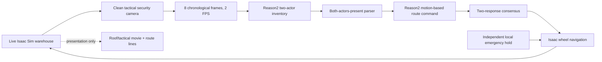

# Camera-only edge AI warehouse supervisor in Isaac Sim

This tutorial runs a live warehouse in Isaac Sim 6.0.1, continuously sends
clean security-camera images to Cosmos-Reason2-2B on a Dragonwing IQ-9075 EVK,
and lets one bounded model command change RobotBlue's active navigation route.

The published demonstrations are camera-only: the prompt contains no simulator
coordinates, actor tracks, route occupancy, expected hazard label, or
`TRACKED_SCENE_FACTS`. Isaac state is still used for deterministic simulation,
recording, acceptance checks, and an independent emergency hold.

## Published results

The current visual walkthrough uses the east-wall blind-corner run. The
clear-route run remains as an archived quantitative control from the earlier
camera revision; its old animation is intentionally no longer embedded:

| Demonstration | EVK responses | Applied behavior | Destination |
| --- | ---: | --- | --- |
| Clear-route control `20260729_134526_4deddb91` | 37 | stayed on the direct route | northwest goal reached |
| Blind-corner congestion `20260729_184944_04a2a3d4` | 15 | two-vote EVK north reroute before RobotBlue can see the forklift | bypass goal reached |

The EVK endpoint exposed `local/cosmos-reason2-2b:Q4_0`. Model input was a
real eight-frame, four-second H.264 video generated from the clean tactical
camera at 384 × 216 and 2 FPS. Isaac continued running while each request was
processed.

### Historical frame-count sweep

These archived reruns used the earlier tactical-camera placement, the same
compact two-actor inventory, 2 FPS encoding, a three-response gateway, and
bounded actions. Eight frames was the only reduced operating point whose
hazard and clear trials both passed:

| Frames / history | Hazard mean / P95 | Clear mean / P95 | Full-run result |
| --- | ---: | ---: | --- |
| 12 / 6 s | 8.267 / 8.492 s | 5.594 / 8.365 s | hazard passed; clear falsely rerouted |
| **8 / 4 s** | **4.559 / 6.258 s** | **3.155 / 3.190 s** | **both passed** |
| 6 / 3 s | 2.676 / 2.630 s | 2.611 / 2.627 s | clear passed; hazard missed |

The six-frame hazard run produced only two isolated reroute proposals across
80 responses. It never reached the required streak of three, so the
independent local safety layer stopped RobotBlue and the run timed out. The
12-frame clear run produced three consecutive false proposals, so the gateway
accepted a wrong bypass. At eight frames, the hazard reached the north bypass
without a safety takeover and the clear run returned 37/37 continue commands.

The older 20-frame runs remain preserved as a historical reference:
12.931 s mean / 19.062 s P95 for the hazard and 9.820 s mean / 19.488 s P95
for the clear control. They predate the fully matched compact-inventory sweep,
so use them as a latency reference rather than a strict accuracy comparison.
These are one full trajectory per setting, not a production accuracy study.

### Archived control: clear route

The forklift is disabled. RobotBlue drives east, turns north, and then drives
west to the northwest destination using the Isaac wheel controller.

Reason2 returned 37 `CONTINUE_CURRENT_ROUTE` proposals and no reroute
proposals. No local safety hold was needed, the active route remained
`direct`, and the northwest destination was reached.

This result is retained for comparison in the machine-readable evidence, but
its animation used the previous tactical-camera placement and is not presented
as current tutorial media.

### Demonstration 2: blind-corner north reroute

The forklift begins behind the stocked northeast rack and moves south toward
the constrained corner. RobotBlue approaches from the west on its original
route. Pallets remove the useful southern clearance, while the northern aisle
remains open.

The tactical camera is mounted just inside the east wall and looks across the
stocked rack. It sees the emerging relationship between the two actors while
the rack still completely hides the forklift from RobotBlue's forward camera.
Requests `live-001` and `live-002` returned consecutive
`REROUTE_NORTH_BYPASS` proposals. The second response satisfied the gateway
and changed the active route once.

At that instant RobotBlue was at x = -1.106 m, approximately 1.1 m or 3.7
simulated seconds before the x = 0 junction at 0.3 m/s. Its synchronized
forward-camera image contains the stocked rack and pallets but no forklift,
mast, or forks. This is the important demonstration result: the supervisor
command arrives before the robot's own line of sight would support the same
decision.

Across the complete run:

| Measurement | Value |
| --- | ---: |
| `CONTINUE_CURRENT_ROUTE` responses | 2 |
| `REROUTE_NORTH_BYPASS` responses | 13 |
| Confirmations required | 2 |
| Mean model time | 5.733 s |
| P95 model time | 6.179 s |
| Mean host end-to-end time | 6.233 s |
| P95 host end-to-end time | 6.680 s |
| Request failures | 0 |
| Local safety takeovers | 0 |
| Applied route changes | 1 |
| Destination | north-bypass goal reached |

Repeated reroute proposals after the route is latched are logged as
reaffirmations; they do not apply additional route changes.


[Download the blind-corner MP4](media/isaac_sim_edge_supervisor_east_wall_r5/blind_corner_east_wall_evk.mp4).

The following two images are synchronized at route application. They show what
the two cameras saw when the already-completed EVK response was applied; they
are not a substitute for the earlier eight-frame model input shown below.


[Download the exact eight-frame model input that produced the accepted second vote](media/isaac_sim_edge_supervisor_east_wall_r5/exact_model_input_live002.mp4).

Machine-readable records:

- [east-wall blind-corner evidence](evidence/iq9075_isaac_east_wall_blind_corner_r5.json)
- [eight-frame blind-corner evidence](evidence/iq9075_isaac_rolling_video_blind_corner_r4.json)
- [eight-frame clear-control evidence](evidence/iq9075_isaac_rolling_video_clear_control_r4.json)
- [six/eight/twelve-frame sweep](evidence/iq9075_isaac_rolling_video_frame_sweep_r4.json)

All older scene experiments, failed takes, and recordings remain under
`artifacts/` and the older `docs/media/isaac_sim_*` directories.

## What Reason2 actually sees

Each request now contains every frame from a rolling eight-frame
tactical-camera window. Frames remain in chronological order and are encoded
at 2 FPS, so each request contains four seconds of visible motion. No
`EARLIER`/`NOW` labels, side-by-side layout, timestamps, route lines, or UI
overlays are burned into the 384 × 216 input.

The model frames come from a fixed 1280 × 720 offscreen sensor and are
downsampled to 384 × 216, so both are 16:9 and no stretch or crop is applied.
The docked interactive viewport may have a different aspect ratio when the
operator resizes it; that UI viewport is not the model input.


This is the exact `live-002` input that supplied the accepted second vote. The
forklift is clear, but RobotBlue enters only as a very small clipped fragment
at the extreme left late in the window. Reason2 nevertheless reported both
actors present. This is a real weakness in the take: the synchronized
application-time images prove that RobotBlue still lacked forklift line of
sight, but the exact model clip provides only marginal visual support for
RobotBlue's identity and motion. A future camera/timing revision should keep
more of RobotBlue inside the supervisor frame before accepting a reroute.

The cyan, white, and orange route lines are presentation-only. Before capturing
the model frames, the runner hides all route and transient planner geometry.
The operator panel is also excluded.

The current first-stage prompt is a compact two-actor inventory:

```text
Inspect every frame of the attached warehouse image or video using only visible
pixels, then report each traffic-actor category once. RobotBlue is the compact
white low-profile mobile robot. A forklift is a larger industrial
counterbalance vehicle with long front forks, an upright mast, and an
operator cage. Shelving, cartons, pallets, cones, barriers, floors, and walls
are not traffic actors.
Reply with exactly these two lines, replacing STATUS with PRESENT, ABSENT, or
UNCERTAIN:
mobile robot: STATUS
forklift: STATUS
Do not list individual frames or add other categories, descriptions, motion,
or intent.
```

The gateway parses both category lines. Unless both `mobile robot:` and
`forklift:` are explicitly `PRESENT`, the bounded result is
`CONTINUE_CURRENT_ROUTE` and route reasoning is skipped.

When a forklift is reported, the second request uses this exact prompt:

```text
Watch the complete fixed warehouse-camera video in chronological order, from
its first frame through its final frame. RobotBlue is the compact white
low-profile robot. A forklift is a larger industrial counterbalance vehicle
with long front forks, an upright mast, and an operator cage. Shelves, cartons,
pallets, cones, barriers, floors, and walls are static objects, not traffic
actors.

Reply RobotBlue REROUTE_NORTH_BYPASS only when visible motion across the video
shows the forklift and RobotBlue converging on the same narrow passage and
their nearest-body gap clearly decreases from earlier frames to later frames.
If no forklift is visible, either actor is unclear, their gap does not clearly
decrease, or the evidence is uncertain, reply
RobotBlue CONTINUE_CURRENT_ROUTE.
Reply with exactly one of those two commands and no explanation.
```

The grammar permits exactly:

```text
RobotBlue CONTINUE_CURRENT_ROUTE
RobotBlue REROUTE_NORTH_BYPASS
```

No south route is silently removed from a dynamic fact map; this focused
scenario deliberately tests only the predeclared direct-route versus north
bypass policy.

For a matched archived hazard window, the 20-frame input and the old
two-endpoint control both selected the north bypass. The real video took
13.237 seconds on the EVK versus 4.330 seconds for the endpoint pair. The
rolling clip is slower, but it preserves the intervening motion rather than
asking the model to infer it from two snapshots.

## Scene-element recognition

Reason2 does recognize the two important actors. Replaying the exact moving
forklift window through the current compact inventory returned:

```text
mobile robot: PRESENT
forklift: PRESENT
```

The exact prior false-positive clear window returned:

```text
mobile robot: PRESENT
forklift: UNCERTAIN
```

Because only an explicit `PRESENT` opens the motion-reasoning stage, this
replay continued safely in 6.529 seconds. Separate no-actuation EVK probes also
recognized metal shelving, cardboard cartons, wooden pallets, traffic cones,
and walls. Those probes are evidence of object recognition—not evidence of
reliable general scene reasoning.

- [scene-element probe](evidence/iq9075_cosmos_reason2_scene_elements_visual_r2.json)
- [actor-recognition probe](evidence/iq9075_cosmos_reason2_actor_recognition_visual_r2.json)

The practical failure mode remains semantic instability. The compact
two-actor inventory produced 37/37 clear responses at eight frames, but the
archived 12-frame clear rerun still produced one three-window false streak and
applied the wrong bypass. Consensus reduces isolated errors but is not proof
against correlated visual errors. The latest blind-corner take uses two
confirmations and adds synchronized robot-camera evidence to verify that the
accepted command is genuinely anticipatory.

## Closed-loop architecture



RobotBlue uses bounded waypoint steering into Isaac's
`DifferentialController`, then `ArticulationController`. It rotates with its
driving direction and moves through wheel actuation; it is not translated
between authored keyframes.

The model cannot command the forklift. The gateway can command only RobotBlue,
and repeated reroute responses after the route is active are latched rather
than reapplied.

## Scene and checkpoint

The lightweight warehouse uses supplied Isaac Sim assets for the Nova Carter
robot, forklift, rack modules, cartons, and pallets. It avoids the much heavier
full warehouse scene while retaining realistic logistics geometry.

The current recoverable checkpoint is:

```text
artifacts/isaac_sim_checkpoints/
  lightweight_warehouse_v17_extended_north_east_wall_narrow_camera.usda
```

The north wall and forklift run-up are extended by one metre. The tactical
camera sits just inside the east wall with a 24 mm lens and looks across the
stocked blind-corner rack. Duplicated carton rows and bottom pallets block
RobotBlue's direct view of the forklift without blocking the supervisor.

## Install and launch Isaac Sim

Extract Isaac Sim to:

```text
C:\NVIDIA\isaac-sim-standalone-6.0.1
```

Run NVIDIA's setup and compatibility checks once:

```powershell
& "C:\NVIDIA\isaac-sim-standalone-6.0.1\post_install.bat"
& "C:\NVIDIA\isaac-sim-standalone-6.0.1\isaac-sim.compatibility_check.bat"
```

Start Isaac Sim with the repository launcher:

```powershell
.\integrations\isaac_sim_mcp\launch_isaac_sim_poc.ps1
```

The launcher uses:

```text
C:\NVIDIA\isaac-sim-standalone-6.0.1\isaac-sim.bat
```

It enables the local Python server and supervisor panel and caps the Kit
application/render loops at 60 FPS.

Verify the local bridge:

```powershell
python .\integrations\isaac_sim_mcp\server.py --check-isaac
```

## Start the EVK service

Copy and start the persistent GenieX service:

```powershell
scp .\scripts\start_evk_geniex_isaac_service.sh `
  ubuntu@192.168.1.158:/tmp/start_evk_geniex_isaac_service.sh

ssh ubuntu@192.168.1.158 `
  "bash /tmp/start_evk_geniex_isaac_service.sh"
```

The address is the tutorial lab device, not a credential.

Confirm the model:

```powershell
ssh ubuntu@192.168.1.158 `
  "curl -s http://127.0.0.1:18181/v1/models"
```

## Run the blind-corner demonstration

```powershell
python .\scripts\run_live_isaac_evk_supervisor.py `
  --inference-backend evk `
  --evk-target ubuntu@192.168.1.158 `
  --scenario blind_corner `
  --supervisor-profile vision_only `
  --vision-input rolling_video `
  --sensor-camera tactical `
  --presentation-camera sensor `
  --motion-controller isaac_graph `
  --robot-speed 0.3 `
  --robot-scale 1.0 `
  --capture-fps 2 `
  --model-fps 2 `
  --frames-per-window 8 `
  --evk-video-width 384 `
  --clear-baseline-responses 0 `
  --forklift-release-x -1.5 `
  --reroute-confirmations 2 `
  --max-responses 0 `
  --max-runtime-seconds 300 `
  --make-gif
```

This reproduces the measured eight-frame, two-confirmation east-wall profile.

## Run the clear control

This uses the same tactical model input but records the wider roof view:

```powershell
python .\scripts\run_live_isaac_evk_supervisor.py `
  --inference-backend evk `
  --evk-target ubuntu@192.168.1.158 `
  --scenario clear_route_control `
  --supervisor-profile vision_only `
  --vision-input rolling_video `
  --sensor-camera tactical `
  --presentation-camera roof `
  --presentation-route-visualizations `
  --motion-controller isaac_graph `
  --robot-speed 0.75 `
  --capture-fps 2 `
  --model-fps 2 `
  --frames-per-window 8 `
  --evk-video-width 384 `
  --clear-baseline-responses 0 `
  --reroute-confirmations 3 `
  --safety-hold-distance 2.2 `
  --max-runtime-seconds 300 `
  --make-gif
```

Every run gets an immutable directory:

```text
artifacts/isaac_sim_live_aisle/runs/<run-id>/
├── events.jsonl
├── frames/
├── requests/
├── summary.json
├── robot_pov_at_reroute.png
├── live_aisle_supervisor.gif
└── live_aisle_supervisor.mp4
```

The live operator status is written atomically to:

```text
artifacts/isaac_sim_live_aisle/live_status.json
```

## Supervisor panel

Open **Window → Edge AI Warehouse Supervisor**. The panel shows the live
request, device and model timing, recent clean model images, raw inventory,
proposed command, consensus state, accepted route, actor state, recent
responses, and exact prompts.

The panel is operator instrumentation. It is not part of Reason2's input.

## Acceptance checks

A publishable blind-corner take must satisfy:

1. The supervisor sees both traffic actors before RobotBlue can see the
   forklift from its own forward camera.
2. Model requests contain eight real chronological frames and no tracked
   simulator facts, route overlays, or UI.
3. The forklift is released after the configured approach trigger.
4. The actor gate reports both categories present and the motion stage proposes
   the north bypass.
5. Exactly one route change is applied.
6. RobotBlue visibly turns and reaches the north-bypass destination.
7. No request fails and the local emergency hold does not take over.

A publishable clear control must reach the northwest destination on the direct
route with a reroute streak below three and no applied reroute. Isolated raw
false proposals must remain visible in the evidence summary.

Run the focused tests:

```powershell
python -m unittest `
  tests.test_run_live_isaac_evk_supervisor `
  tests.test_request_isaac_edge_supervisor_advisory `
  tests.test_isaac_sim_mcp
```

The current focused suite contains 56 passing tests.

## Scope and next steps

This is a successful developer demonstration, not a production safety claim.
It proves a live camera → EVK model → bounded command → Isaac wheel-navigation
loop and exposes the model's false-proposal rate.

The next useful scenarios are:

1. both bypasses blocked, where the only safe action is `YIELD HOLD`;
2. two commandable AMRs with actor-addressed commands;
3. a crossing human or carried load;
4. a second calibrated camera angle or camera grid to reduce rack/forklift
   confusion.

Each should retain independent safety control, multi-window confirmation, raw
response logs, and a matched no-hazard control.
